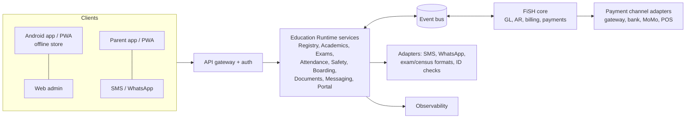
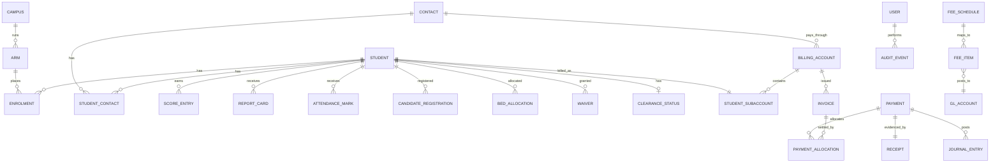

# FiSH+ER Education Runtime — Technical Requirements Specification and Use Case Document

**The Prodeo Group Ltd**

## 1. Document control and executive summary

### 1.1 Document control

| Field | Value |
|---|---|
| Title | FiSH+ER Education Runtime — Technical Requirements Specification and Use Case Document |
| Product | FiSH+ER (FiSH + Education Runtime): Secondary School Registry |
| Organisation | The Prodeo Group Ltd (UK). Irish subsidiary Prodeo Limited planned |
| Version | 0.1 (Draft) |
| Date | 1 October 2026 |
| Author | [Organisation/Author] |
| Status | Draft for review |
| Source documents | Secondary School Registry System SRD v0.2 and Use Case Document v0.2 (West Africa) |

**Change log**

| Version | Date | Author | Change |
|---|---|---|---|
| 0.1 | 1 Oct 2026 | [Organisation/Author] | First combined specification. Consolidates the West Africa SRD and use cases v0.2. Re-IDs functional requirements under the ER- prefix. Adds the FiSH core boundary, integration contracts (FIN-INT), chart-of-accounts mapping, technical architecture, phasing, Francophone variants (Guinea, Côte d'Ivoire) and use cases UC-13 and UC-14 |

**Reviewers (to be confirmed):** Prodeo product owner; FiSH core architecture lead; Education Runtime engineering lead; Prodeo data protection lead; pilot school proprietor/principal and bursar; implementation partner(s).

### 1.2 Executive summary

FiSH+ER (FiSH + Education Runtime) is The Prodeo Group's education platform for secondary schools. It combines two parts:

- **FiSH:** Prodeo's financial core (GL-as-a-Service / Total Finance Information System), which provides the general ledger, accounts payable and receivable, billing, payments and financial reporting.
- **The Education Runtime (ER):** the education layer that runs on top of FiSH. Its core is the **Secondary School Registry**, which holds students, families, staff, classes, assessment and report cards, external exams, attendance, boarding, safety and safeguarding, documents and parent engagement.

The first markets are Nigeria and the Mano River area (Sierra Leone, Liberia, Guinea, Côte d'Ivoire), followed by Ghana and The Gambia. The UK is a later market (Appendix B). Customers are mainly private schools and multi-campus school groups, plus public schools through state or national ministries.

The design priorities are:

1. offline-first operation on low-cost Android devices with intermittent power and internet;
2. SMS and WhatsApp as primary parent channels;
3. fees, invoicing, payments and receipting delivered by the FiSH core through defined integration contracts, so school finance is ledger-grade from day one;
4. compliance with children's data protection law (e.g. Nigeria's NDPA 2023 and GAID 2025);
5. configuration-driven country variants (levels, exams, grading, currencies, languages).

This document contains 230 uniquely numbered requirements (164 Must, 57 Should, 9 Could), 14 use cases, the integration contracts with FiSH, and a phased roadmap. Statutory and exam-body specifics that could not be verified are marked **to be confirmed (TBC)**.

## 2. Product context

### 2.1 FiSH core and the Education Runtime

| Layer | Responsibility |
|---|---|
| FiSH core (financial) | General ledger, chart of accounts, accounts receivable (billing accounts, invoices, credit notes, statements), payments and receipting across channels, accounts payable, multi-currency, financial reporting and audit. Interfaces described here are **to align with the FiSH core design** |
| Education Runtime (ER) | Secondary School Registry (students, contacts, staff, structure), assessment and report cards, external exams, attendance, safety and safeguarding, boarding, documents, messaging, parent portal/app, census and ministry exports, and the education-side fee rules (who is charged what, and clearance policy) |
| Shared platform | Identity and access, tenancy, audit, notifications infrastructure, observability, data residency |

### 2.2 Markets and country variants (configurable; TBC)

| Country | Levels | Main exams | Data protection | Currency | Language |
|---|---|---|---|---|---|
| Nigeria (reference) | JSS1–3, SS1–3 (6-3-3-4) | State BECE / NECO BECE (Federal Unity Colleges); WAEC WASSCE, NECO SSCE, NABTEB; JAMB UTME (record only) | NDPA 2023, GAID 2025 | NGN | English |
| Sierra Leone | JSS1–3, SSS1–3 | BECE, WASSCE (WAEC) | Bill pending (TBC) | SLE | English |
| Liberia | Grades 7–9, 10–12 | Grade 9 national exam (TBC), WASSCE (WAEC) | Bill pending (TBC) | LRD, USD | English |
| Guinea | Collège / lycée (structure TBC) | BEPC, Baccalauréat (TBC) | Law L/2016/037/AN (cybersecurity and personal data) | GNF | French |
| Côte d'Ivoire | Collège / lycée (structure TBC) | BEPC, Baccalauréat (TBC) | Law No. 2013-450 (personal data) | XOF | French |
| Ghana | JHS1–3, SHS1–3 (Free SHS, CSSPS placement, boarding) | BECE, WASSCE (WAEC) | Act 843 (2012) | GHS | English |
| The Gambia | Grades 7–9, 10–12 | GABECE, WASSCE (WAEC) | PDPPA 2025 (commencement TBC) | GMD | English |

Further variant detail (identifiers, regulators, census, SS structure) follows SRD v0.2 Section 3.5 and is held as configuration packs.

### 2.3 Boundaries

| Capability | Education Runtime | FiSH core |
|---|---|---|
| Student, family and fee payer master data | Owns | Holds billing accounts linked to ER IDs |
| Fee structure (education rules: level, stream, boarding, campus, term) | Owns the rules and selection | Owns billing items, prices and GL mapping |
| Invoices, credit notes, statements | Requests and displays | Owns (creates, numbers, posts) |
| Payments (all channels) and receipts | Initiates portal checkout and shows status. Captures offline cash provisionally | Owns (gateway, bank, mobile money and POS integrations; receipt numbering; allocation) |
| Scholarships, discounts, waivers | Owns eligibility and approval (education context) | Posts as discounts/credit notes to mapped accounts |
| Arrears and balances | Consumes for clearance and messaging | Owns |
| Clearance policy | Owns policy evaluation and safeguards | Supplies balances |
| Ledger postings, financial reports | Links/embeds | Owns |
| Payroll, procurement, general AP | Out of scope for ER | FiSH (outside this document) |

### 2.4 Integration points

1. Identity and tenancy: shared tenant IDs (school group → school → campus ↔ FiSH entity/ledger) and single sign-on.
2. Master data: student/fee payer → billing account.
3. Fee structure: ER fee rules → FiSH billing items and prices, via the chart-of-accounts mapping.
4. Billing runs: term start → bulk invoicing.
5. Payments: FiSH payment events → ER fee status, clearance and notifications.
6. Portal checkout: ER portal → FiSH payment session API.
7. Waivers and refunds: ER approvals → FiSH adjustments.
8. Reporting: FiSH financial reports surfaced in ER dashboards.
9. Reconciliation: daily ER ↔ FiSH consistency checks.

### 2.5 Integration contracts: events

Events are published to the platform event bus with at-least-once delivery, idempotency keys and per-account ordering (FIN-INT-011). Payload schemas are **to align with the FiSH core design**.

| Event | Producer → Consumer | Trigger | Key payload | Effect |
|---|---|---|---|---|
| StudentEnrolled | ER → FiSH | Student activated (UC-01) | tenant, campus, studentId, admissionNo, feePayer(s), level, stream, boarding status, start term | Create or link the billing account (family/payer) and the student sub-account |
| StudentUpdated | ER → FiSH | Change to billing-relevant fields (level, arm, boarding, campus, payer) | studentId, changed fields, effective date | Update the billing account. Re-rate future invoices where configured |
| StudentStatusChanged | ER → FiSH | Withdrawn, graduated, suspended, transferred | studentId, status, effective date | Stop future billing. Produce the final statement |
| FeePayerChanged | ER → FiSH | Sponsor/guardian change | studentId, old/new payer, split % | Re-assign the billing account or split billing |
| FeeScheduleChanged | ER → FiSH | Fee rules published for a session or term | schedule version, items, rules, amounts, currency | Create/update billing items and prices, mapped to GL accounts |
| BillingRunRequested | ER → FiSH | Term start or manual run (UC-13) | term, campus, scope, run ID, dry-run flag | Generate invoices in bulk |
| InvoiceIssued | FiSH → ER | Invoice posted | invoiceId, studentId, amount, due date, lines | Show the invoice. Notify the payer |
| PaymentReceived | FiSH → ER | Payment allocated (any channel) | paymentId, receiptNo, studentId(s), amount, channel, allocation | Update fee status and clearance. Send the receipt notification |
| PaymentReversed | FiSH → ER | Chargeback, bounced transfer, void | paymentId, reason | Re-evaluate clearance. Notify the Bursar |
| AccountBalanceChanged | FiSH → ER | Any posting affecting a balance | billing account, balance, overdue amount, ageing | Re-evaluate clearance (ER-FEE-008) |
| WaiverApproved | ER → FiSH | Scholarship/discount approved | studentId, type, amount or %, term(s), approver | Post a discount/credit note to the mapped account |
| RefundRequested / RefundIssued | ER → FiSH / FiSH → ER | Refund approved / paid | studentId, amount, reason | Post the refund. Update status |
| ExamFeeRegistered | ER → FiSH | Candidate registered for an exam (UC-11) | studentId, exam body, series, fee item | Invoice the exam fee to a pass-through liability account |
| ClearanceStatusChanged | ER → ER/portal | Policy evaluation | studentId, status, items withheld, reason | Update the portal and staff views. Notify the parent |

### 2.6 Integration contracts: APIs

All APIs are REST/JSON with OAuth 2.0 client credentials, versioned (e.g. /v1), with idempotency keys on create operations. FiSH endpoints are **to align with the FiSH core design**.

| API | Provider | Purpose |
|---|---|---|
| Billing Accounts | FiSH | Create, link and query billing accounts and student sub-accounts |
| Billing Items and Prices | FiSH | Maintain fee items and prices by schedule version |
| Invoices | FiSH | Bulk create (billing run), query, download PDF |
| Payments / Checkout | FiSH | Create a payment session for the portal. Query status. List payments |
| Receipts | FiSH | Retrieve receipts. Allocate offline receipt number ranges to registered devices |
| Adjustments | FiSH | Discounts, credit notes, refunds, write-offs (with approval references) |
| Balances and Statements | FiSH | Current balance, ageing, statements per payer or student |
| Chart-of-Accounts Mapping | FiSH | Read and maintain fee item → GL account mappings |
| Students and Payers | ER | Look up student, payer and structure (level, arm, campus) for FiSH |
| Clearance | ER | Query clearance status and reasons |

### 2.7 Chart-of-accounts mapping (illustrative)

The final chart of accounts and revenue recognition policy are **to align with the FiSH core design** and each school's accounting policy (TBC).

| Transaction | Debit | Credit | Notes |
|---|---|---|---|
| Tuition/boarding invoice | Fees receivable (control) | Tuition / boarding revenue, or deferred income if billed before term | Recognition over the term (TBC) |
| Development or other levies | Fees receivable | Levy revenue or designated fund | Treatment TBC per school |
| PTA or other collections on behalf | Fees receivable | PTA payable (liability) | Pass-through, not revenue |
| Exam registration fees | Fees receivable | Exam fees payable (liability) | Cleared on remittance to the exam body |
| Books/uniform sales | Fees receivable | Sales revenue | Inventory out of scope |
| Payment by bank transfer/deposit | Bank | Fees receivable | |
| Payment by gateway or mobile money | Gateway/MoMo clearing | Fees receivable | On settlement: Dr Bank, Dr Charges, Cr Clearing |
| Cash/POS | Cash / POS clearing | Fees receivable | Daily cash-up (ER-FEE-009) |
| Scholarship/discount/waiver | Scholarships expense or discounts (contra-revenue) | Fees receivable | Per policy |
| Overpayment/advance | Bank | Customer advances (liability) | Applied to the next invoice |
| Refund | Customer advances or fees receivable | Bank | Approval required |
| Bad-debt write-off | Bad-debt expense | Fees receivable | FiSH approval workflow |

## 3. Stakeholders, roles and actors

### 3.1 Stakeholders

| Stakeholder | Interest |
|---|---|
| The Prodeo Group (product, FiSH core team, ER engineering) | Product scope, architecture, integration, commercial model |
| School proprietors, school group leaders, principals | Control, visibility, compliance, fee collection |
| Bursars and finance staff | Accurate billing, receipting and reconciliation |
| Registrars, exams officers, teachers, form masters/mistresses | Efficient records, scores, report cards and exam registration |
| Child Protection Focal Persons, boarding staff, gate/security staff | Child safety and protection |
| Parents/guardians and students | Timely information, easy payment, privacy |
| Regulators and ministries (e.g. NDPC; Federal/State Ministries of Education, SUBEB; GES; MBSSE) | Compliance, census and inspection data |
| Exam bodies (WAEC, NECO, NABTEB, state BECE authorities, Francophone exam authorities) | Accurate candidate data (external; no direct integration assumed) |
| Payment, messaging and hosting providers; implementation partners | Integration and delivery |

### 3.2 User roles

Roles are built from configurable permission sets.

| Role | Description | Typical access |
|---|---|---|
| System Administrator | Configures schools, campuses, roles, integrations | Configuration and users. No safeguarding content by default |
| Proprietor / Principal / Head | School or group leadership | Dashboards, approvals (results, promotion, waivers, clearance), all non-restricted data in scope |
| School Admin / Registrar | Admissions, records, documents, exams (Exams Officer sub-role) | Create/edit student, contact and staff records; exam registration |
| Bursar / Accounts | Fees, invoices, payments, receipts | Fee data and the student fields needed for billing only |
| Teacher (subject teacher) | Enters CA and exam scores, takes lesson attendance | Own subjects and arms |
| Form Master/Mistress | Class teacher for an arm | Own arm: attendance, report card comments, affective/psychomotor ratings |
| Vice Principal / Head of Section / House Master/Mistress | Oversees a section (JSS/SS) or house | Students in scope, attendance, discipline/pastoral notes, reports |
| Boarding staff (Hostel master/mistress, Matron, Nurse) | Boarding and sick bay | Hostel allocation, exeat, roll call; sick bay records (nurse) |
| Child Protection Focal Person (CPFP) | Leads child protection | Restricted notes, child protection flags, custody/contact restrictions |
| Security / Gate staff | Gate and visitor control | Visitor log, pickup verification (name, photo, authorised persons only) |
| Read-only / Auditor | Group auditor, ministry inspector, external auditor | Read-only access scoped by purpose and time |
| Parent / Guardian | Portal/app and SMS/WhatsApp (phase 1 Should) | Own children's permitted information and fees |
| Student | Self-service (Could) | Own timetable, results, notices |

In addition, FiSH finance roles (e.g. AR clerk, finance manager, auditor) are managed in the FiSH core. Single sign-on and role mapping (e.g. ER Bursar ↔ FiSH AR clerk) are covered by FIN-INT-017.

### 3.3 External actors and systems

FiSH core; exam body portals; ministry/census systems (e.g. DNEMIS); payment gateways, banks, mobile money and POS (through FiSH); SMS and WhatsApp business messaging providers; email; identity verification services (where lawful; TBC); malware scanning service.

## 4. Functional requirements

Priorities: **Must** = required for general availability in the target country; **Should** = important, expected unless agreed otherwise; **Could** = desirable. MVP scope is defined in Section 10. ER requirements are delivered by the Education Runtime unless a "Delivered by" column says otherwise.

### 4.1 Student enrolment and records (ER-ENR)

| ID | Requirement | Priority |
|---|---|---|
| ER-ENR-001 | Admission workflow from enquiry or application through entrance exam/interview, offer, acceptance and enrolment, creating a student record with: surname, first and middle names, preferred name, date of birth, sex, address, level/arm, admission date, entry route (new intake, transfer, placement) and status (applicant, active, suspended, withdrawn, graduated). | Must |
| ER-ENR-002 | Generate a unique admission number using a configurable format (e.g. school code/year/serial). Detect duplicates on name, date of birth and parent phone number. | Must |
| ER-ENR-003 | Configurable bio-data fields: nationality, state and LGA of origin (Nigeria), religion (sensitive, optional), languages, previous school, and special needs/disability. | Must |
| ER-ENR-004 | Optional national identifiers, stored as sensitive and masked by default: NIN (Nigeria), the national learner ID where available (e.g. Nigeria LIN), Ghana Card number, BECE index number, and exam numbers (ER-EXM). | Must |
| ER-ENR-005 | Health summary: blood group, genotype, allergies, chronic conditions, medication and emergency medical consent, shown prominently to authorised staff. | Must |
| ER-ENR-006 | Ghana variant: import or record CSSPS placement details (index number, placement school, programme, boarding/day status) and confirm reporting/admission. | Should |
| ER-ENR-007 | Withdrawal, transfer and graduation: record date, reason and destination. Check outstanding clearance items (fees, property, library) under the clearance policy (ER-FEE-008). Issue a transfer letter or testimonial. | Must |
| ER-ENR-008 | Keep effective-dated history of key fields (name, level/arm, house, status, boarding status), showing previous values, who changed them and when. | Must |
| ER-ENR-009 | Capture a student photo with consent, using the device camera with compression. | Should |
| ER-ENR-010 | Online application form and entrance exam scheduling/results for prospective students. | Could |

### 4.2 Staff records (ER-STF)

| ID | Requirement | Priority |
|---|---|---|
| ER-STF-001 | Staff profile: name, staff number, roles (teaching/non-teaching), subjects, arms, department, campus, contact details, next of kin, start/exit dates. | Must |
| ER-STF-002 | Employment summary: type (permanent, contract, part-time, volunteer, corps member/national service), dates. Pay and salary data are excluded (payroll is out of scope). | Must |
| ER-STF-003 | Qualifications and professional registration (e.g. TRCN number in Nigeria, NTC licence in Ghana, Teaching Service Commission registration in Sierra Leone; TBC per country), with expiry dates. | Must |
| ER-STF-004 | Vetting and safety checks: identity verification, references, police clearance or background check where available, guarantor details where school policy requires them, and child protection training. Restricted to authorised roles. | Must |
| ER-STF-005 | Staff vetting/check status report highlighting missing or expired items. | Must |
| ER-STF-006 | Reminders for expiring registrations, checks and contracts. | Should |
| ER-STF-007 | Record staff data needed for ministry or census returns. | Should |

### 4.3 School structure, classes, arms and houses (ER-CLS)

| ID | Requirement | Priority |
|---|---|---|
| ER-CLS-001 | Configure sessions (academic years), three terms per session with dates, and levels per country variant (e.g. JSS1–SS3, JHS1–SHS3, Grades 7–12). | Must |
| ER-CLS-002 | Manage arms within levels (e.g. JSS1A) with form masters/mistresses and capacities. | Must |
| ER-CLS-003 | Configure senior streams, fields or programmes (e.g. Science/Humanities/Business plus a compulsory trade subject under the Nigerian 2025/26 curriculum; legacy Science/Arts/Commercial; Ghana SHS programmes) and assign students. | Must |
| ER-CLS-004 | Subject catalogue per level and stream (core, elective, trade). Subject-teacher allocation per arm. Student subject combinations, with validation of required core subjects. | Must |
| ER-CLS-005 | Houses with house masters/mistresses, and student allocation to houses. | Must |
| ER-CLS-006 | Prefects and student leadership roles (e.g. head boy/girl, house and class prefects) with terms of office. | Should |
| ER-CLS-007 | A simple timetable (periods per arm), entered manually or imported, linked to subject teachers. | Should |
| ER-CLS-008 | Multi-campus school groups: shared configuration templates with per-campus overrides. | Must |

### 4.4 Assessment, report cards and promotion (ER-ASM)

| ID | Requirement | Priority |
|---|---|---|
| ER-ASM-001 | Configure the score structure per level and term: number of CA components and their weights, and the exam weight (e.g. 30/40 CA + 70/60 exam), with validation that the total is 100. | Must |
| ER-ASM-002 | Configurable grading scales per level and country (e.g. A1–F9, A–F, 1–9) with score bands and remarks. | Must |
| ER-ASM-003 | Teachers enter CA and exam scores per subject and arm, online or offline, with range validation and a submission deadline. | Must |
| ER-ASM-004 | Result approval workflow: subject teacher → form master/mistress → principal (configurable), then publication to parents. Published results are locked; changes after locking need approval and are audited. | Must |
| ER-ASM-005 | Calculate totals, averages, subject and class positions/rankings, and highest/lowest/average per subject. Positions can be switched off per school or level. | Must |
| ER-ASM-006 | Affective domain ratings (e.g. punctuality, neatness, conduct) and psychomotor ratings (e.g. sports, handwriting, crafts), with configurable rating scales. | Must |
| ER-ASM-007 | Report cards per term, plus a cumulative/annual report, from configurable templates: scores, grades, positions (if enabled), attendance, ratings, teacher and principal comments, next-term date and (configurable) fee balance. PDF output, printable and shareable. | Must |
| ER-ASM-008 | Broadsheets (master score sheets) per arm and level. | Must |
| ER-ASM-009 | Promotion, repeat and probation decisions at session end, using configurable criteria (e.g. minimum average, passes in core subjects), with principal approval and parent notification. | Must |
| ER-ASM-010 | Comment banks and automatic comment suggestions based on performance bands. | Could |
| ER-ASM-011 | Performance analytics by subject, arm, teacher and term. | Should |

### 4.5 External exams and qualifications (ER-EXM)

| ID | Requirement | Priority |
|---|---|---|
| ER-EXM-001 | Configure exam bodies and exams per country variant (e.g. state BECE, NECO BECE, WAEC WASSCE, NECO SSCE, NABTEB, Ghana BECE/WASSCE), with series, centre/school numbers and subject codes. | Must |
| ER-EXM-002 | Candidate registration list: eligible students, chosen subjects, candidate photo and bio-data checks, and generation of the export file or data sheet in the format the exam body requires (format TBC per series). | Must |
| ER-EXM-003 | Record exam/index numbers issued to candidates, plus any learner ID used by the exam body. | Must |
| ER-EXM-004 | Compute and export the CA scores (CASS) required by exam bodies from internal assessment data, using the body's required scaling and format (TBC per series), with a review and sign-off step. | Must |
| ER-EXM-005 | Record exam mode per candidate and series (CBT or paper-based) and any special arrangements. | Should |
| ER-EXM-006 | Import or enter results per candidate and subject, with summary analysis (e.g. credits including English and Mathematics). | Must |
| ER-EXM-007 | Track certificates: receipt from the exam body, collection by the candidate (with ID check), and uncollected certificates. | Must |
| ER-EXM-008 | Record result verification and attestation requests and their outcomes (record only; no integration with exam body verification services required). | Should |
| ER-EXM-009 | Record JAMB UTME details for university applications: registration number, score, chosen institutions and admission status (record only). | Should |
| ER-EXM-010 | Mock exams using the internal assessment structure. | Should |
| ER-EXM-011 | Link exam registration fees to the fees module as fee items (ER-FEE-001). | Should |
| ER-EXM-012 | Francophone exam variants (e.g. BEPC and Baccalauréat in Guinea and Côte d'Ivoire) as configurable exam bodies/series, with formats TBC. | Should |

### 4.6 Attendance (ER-ATT)

| ID | Requirement | Priority |
|---|---|---|
| ER-ATT-001 | Daily attendance register per arm by the form master/mistress (morning, plus optional afternoon session), using configurable status codes (present, absent, late, excused, sick, exeat). | Must |
| ER-ATT-002 | Works fully offline on Android/PWA, with later sync (NFR-OFF). | Must |
| ER-ATT-003 | Configurable absence reasons and lateness recording (time arrived). | Must |
| ER-ATT-004 | Lesson-by-lesson attendance by subject teachers, with flags for students present at registration but absent from a lesson. | Should |
| ER-ATT-005 | Same-day SMS/WhatsApp notification to parents of unexplained absence (configurable). | Should |
| ER-ATT-006 | Alerts for chronic absence (configurable threshold, e.g. 10% of school days) and consecutive-day absence, sent to the form master/mistress, Head of Section and CPFP. | Must |
| ER-ATT-007 | Attendance summaries for report cards, ministry/census returns and exports. | Must |
| ER-ATT-008 | Corrections need a reason. The original mark and an audit trail are kept. | Must |
| ER-ATT-009 | Integration with gate or biometric/card readers for entry/exit times. | Could |

### 4.7 Parent/guardian contacts (ER-CON)

| ID | Requirement | Priority |
|---|---|---|
| ER-CON-001 | Multiple contacts per student (father, mother, guardian, sponsor, other), each linkable to several students (siblings/family). | Must |
| ER-CON-002 | Multiple phone numbers per contact, validated in international format, with primary/WhatsApp flags. Email is optional. | Must |
| ER-CON-003 | Emergency contact priority order. | Must |
| ER-CON-004 | Record legal guardian/custody status and the fee payer/sponsor (who receives invoices). | Must |
| ER-CON-005 | Flag court orders and contact restrictions: show a prominent warning, keep details restricted to the CPFP and principal, link the document, and block information release and pickup. | Must |
| ER-CON-006 | Authorised pickup persons per student, with name, relationship, phone, photo and ID reference. | Must |
| ER-CON-007 | Communication preferences: channel (SMS, WhatsApp, email, app), language, and opt-out of non-essential messages. | Must |
| ER-CON-008 | Record consents (e.g. photos, trips, data processing where consent is the lawful basis) with date, method and who gave consent (parent or guardian, per NDPA s.31 where applicable). | Must |

### 4.8 Safeguarding, safety and security (ER-SAF)

| ID | Requirement | Priority |
|---|---|---|
| ER-SAF-001 | Pastoral and discipline notes with categories and visibility levels: general, or restricted (CPFP/principal only). | Must |
| ER-SAF-002 | Restricted child protection records and flags (e.g. abuse concern, referral to social welfare/police/child protection agency, case status), visible only to the CPFP and designated leaders. Other staff see a "speak to CPFP" indicator. | Must |
| ER-SAF-003 | Incident reporting (e.g. bullying, violence, injury, missing child) with referral pathway steps and escalation timestamps, aligned with the applicable national safe schools framework (TBC per country). | Must |
| ER-SAF-004 | Gate and visitor log: visitor name, phone, ID reference, purpose, person visited, time in/out. Works offline. | Must |
| ER-SAF-005 | Pickup verification at the gate against authorised pickup persons (ER-CON-006), optionally with a one-time pickup code sent to the parent by SMS. Unauthorised attempts are logged and alerted. | Must |
| ER-SAF-006 | Emergency contact and medical list (fire/evacuation list) that can be generated offline per arm or hostel. | Must |
| ER-SAF-007 | Record school safety data (e.g. safety committee, drills, hazards) to support safe school returns (e.g. DNEMIS Safe Schools module; TBC). | Should |
| ER-SAF-008 | Missing student/absconding workflow: alert to the principal, CPFP and parents, with resolution tracking. | Should |
| ER-SAF-009 | Record suspensions and expulsions, with dates, reasons, approvals and parent notification. | Should |

### 4.9 Boarding and hostel management (ER-BRD)

| ID | Requirement | Priority |
|---|---|---|
| ER-BRD-001 | Hostels/dormitories, rooms and beds with capacity, gender and house link. Allocate boarders and keep allocation history. | Should |
| ER-BRD-002 | Exeat/leave-out: request (by a parent or staff), approval, authorised pickup, sign-out and sign-in times, and overdue alerts. | Should |
| ER-BRD-003 | Visiting days: scheduled dates, visitor check against authorised persons, and a visit log. | Should |
| ER-BRD-004 | Sick bay: visit log (complaint, observations, treatment, medication given, referral to hospital), parent notification, and restricted access (nurse/matron/principal). | Should |
| ER-BRD-005 | Boarding roll call (night/morning check), with missing boarder alerts. | Should |
| ER-BRD-006 | Boarders' property checklist at resumption and departure. | Could |

### 4.10 Fees, billing and payments (ER-FEE, delivered with the FiSH core)

The ER defines who is charged what and when, and the clearance policy. The FiSH core issues invoices, records payments, numbers receipts, holds balances and posts to the ledger, through FIN-INT.

| ID | Requirement | Delivered by | Priority |
|---|---|---|---|
| ER-FEE-001 | Fee schedules per session, term, campus, level, stream and day/boarding status, with fee items (e.g. tuition, boarding, development levy, books, uniform, PTA, exam registration). Mandatory and optional items. | ER (rules); FiSH (items/prices) | Must |
| ER-FEE-002 | Termly invoices per student (bulk or individual), with sibling/family consolidation and statements to the fee payer. | FiSH (via FIN-INT-005) | Must |
| ER-FEE-003 | Payments by cash, bank transfer/deposit (with reference), POS, online payment gateway and mobile money. Part payments and instalments. Payment channels are configurable FiSH integrations. | FiSH | Must |
| ER-FEE-004 | Receipts with unique sequential numbers (PDF, print, SMS/WhatsApp/email link). Cancelled receipts are voided with a reason, never deleted. | FiSH (numbering); ER (delivery) | Must |
| ER-FEE-005 | Arrears and balances carried forward, ageing and fee defaulter lists shown in the ER. | FiSH (data); ER (views) | Must |
| ER-FEE-006 | Scholarships, bursaries, discounts and waivers, with eligibility, approval workflow and audit. | ER (approval); FiSH (posting) | Must |
| ER-FEE-007 | One base currency per school/entity with multi-currency support (NGN, GHS, SLE, LRD, USD, GMD, GNF, XOF). Exchange rates are recorded on foreign-currency payments. | FiSH | Must |
| ER-FEE-008 | Configurable clearance policy (e.g. withhold printed report card, transcript or testimonial while fees are outstanding). Safeguards: never blocks attendance, safeguarding, medical or emergency information, the student's education, statutory returns or any legally required information. Each block needs an approved policy, parent notification and principal override, and is logged. Lawfulness TBC per country. | ER | Must |
| ER-FEE-009 | Segregation of duties (users who record payments cannot approve waivers or void receipts). Daily cash-up by cashier. | FiSH + ER roles | Must |
| ER-FEE-010 | Automatic matching of gateway, bank and mobile money payments to invoices, with an exceptions queue. | FiSH | Should |
| ER-FEE-011 | Fee reminders and payment confirmations by SMS/WhatsApp/email. | ER (messaging) | Should |
| ER-FEE-012 | Refunds and credit notes with approval. | ER (request); FiSH (posting) | Should |
| ER-FEE-013 | Ledger postings for all fee transactions using the chart-of-accounts mapping (Section 2.7), replacing any separate journal export. | FiSH | Must |
| ER-FEE-014 | Government-funded and zero-fee items (e.g. Ghana Free SHS), recorded separately from parent-paid items (TBC). | ER + FiSH | Should |

### 4.11 Document storage (ER-DOC)

| ID | Requirement | Priority |
|---|---|---|
| ER-DOC-001 | Attach documents to student, staff and contact records, with configurable types (e.g. birth certificate, passport photo, transcripts, testimonials, transfer letters, ID copies, consent forms, medical reports, court orders). | Must |
| ER-DOC-002 | Version documents and keep previous versions. | Must |
| ER-DOC-003 | Retention tag per document type, with configurable retention rules and a disposal review list. | Must |
| ER-DOC-004 | File type allow-list (e.g. PDF, JPG, PNG, DOCX) and a configurable size limit (proposed 10 MB). Images are compressed on mobile upload. | Must |
| ER-DOC-005 | Scan uploads for malware. Quarantine infected files and alert the uploader. | Must |
| ER-DOC-006 | Documents inherit record permissions, plus a sensitivity level per document type. | Must |
| ER-DOC-007 | Generate transcripts, testimonials and transfer letters from system data, with verification codes (e.g. a QR code linking to a verification page). | Should |
| ER-DOC-008 | Capture documents with the mobile camera, with offline queueing. | Should |

### 4.12 Search and reporting (ER-RPT)

| ID | Requirement | Priority |
|---|---|---|
| ER-RPT-001 | Quick search by name, admission number, exam/index number or parent phone number. | Must |
| ER-RPT-002 | Advanced search with combinable filters (e.g. level, arm, stream, house, boarding status, fee status, campus). | Must |
| ER-RPT-003 | Standard reports: class lists, broadsheets, report card batches, attendance summaries, fee collection and defaulters, staff lists, exam registration lists and results analysis. | Must |
| ER-RPT-004 | Export to PDF, CSV and Excel. Exports are logged. | Must |
| ER-RPT-005 | Census and ministry returns support: produce data for the Nigeria Annual School Census (DNEMIS) and the equivalent returns in other countries, in the required template where published (format TBC). | Must |
| ER-RPT-006 | Reports, searches and exports apply the same role and field-level restrictions as on-screen views. | Must |
| ER-RPT-007 | Custom report builder with saved, shareable reports. | Should |
| ER-RPT-008 | Dashboards for proprietors and principals: enrolment, attendance, fee collection, academic performance, per campus and group-wide. | Should |

### 4.13 Data import/export and bulk operations (ER-IMP)

| ID | Requirement | Priority |
|---|---|---|
| ER-IMP-001 | CSV/Excel import with templates, field mapping, validation preview, dry run and error report. | Must |
| ER-IMP-002 | Migrate data from spreadsheets or the incumbent system, with reconciliation reports. | Must |
| ER-IMP-003 | Bulk operations: session-end promotion (per ER-ASM-009), arm reassignment, bulk invoicing, bulk SMS/WhatsApp, and bulk status updates. | Must |
| ER-IMP-004 | Bulk operations show a preview, are logged and can be reversed. | Must |
| ER-IMP-005 | Full export of the school's data in open formats at any time and on contract exit. | Must |
| ER-IMP-006 | Scheduled exports to external systems (e.g. accounting, ministry). | Should |

### 4.14 Notifications and messaging (ER-NOT)

| ID | Requirement | Priority |
|---|---|---|
| ER-NOT-001 | Send SMS through configurable SMS gateway integrations, with delivery status and cost tracking. | Must |
| ER-NOT-002 | Send WhatsApp messages through a configurable business messaging integration using approved templates (results ready, fee reminders, absence, notices). Fall back to SMS where WhatsApp fails. | Should |
| ER-NOT-003 | Email and in-app/push notifications. | Should |
| ER-NOT-004 | Message templates with merge fields and multi-language versions. Bulk messaging by level, arm, house, fee status or boarding status. | Must |
| ER-NOT-005 | SMS/WhatsApp messages contain no sensitive personal data (e.g. no health or safeguarding detail). Results and fee details are sent as a secure link or a short summary according to school policy. | Must |
| ER-NOT-006 | Messaging credit/budget controls and approval for bulk sends above a threshold. | Should |
| ER-NOT-007 | Staff alerts (absence thresholds, overdue exeat, quarantined files, expiring checks), with role-based routing. Safeguarding alerts go only to the CPFP group. | Must |

### 4.15 Parent/guardian and student portal/app (ER-PPT)

| ID | Requirement | Priority |
|---|---|---|
| ER-PPT-001 | A parent portal/app (PWA or Android) with phone number + OTP login, linked to all of the parent's children (siblings). | Should |
| ER-PPT-002 | Parents can view published results and report cards, attendance, timetable, notices and the school calendar. | Should |
| ER-PPT-003 | Parents can view fee statements and invoices, pay online through configured payment integrations, and download receipts. | Should |
| ER-PPT-004 | Parents can submit exeat requests, update contact details (subject to approval) and complete consent forms. | Should |
| ER-PPT-005 | The portal enforces custody/contact restrictions and guardian status, never exposes restricted data, and applies the clearance policy only as configured under ER-FEE-008. | Must |
| ER-PPT-006 | Low-data mode: lightweight pages and downloadable PDFs. Results summaries are also available by SMS for parents without smartphones. | Should |
| ER-PPT-007 | Student login (mainly senior students) to view their own timetable, results and notices. | Could |

### 4.16 FiSH core integration (FIN-INT)

All FIN-INT interfaces are **to align with the FiSH core design**.

| ID | Requirement | Priority |
|---|---|---|
| FIN-INT-001 | Map each ER tenant (school group/school/campus) to a FiSH entity/ledger with its base currency, configured once and versioned. | Must |
| FIN-INT-002 | On StudentEnrolled, FiSH creates or links a billing account for the fee payer/family and a student sub-account, idempotent on the ER student ID. | Must |
| FIN-INT-003 | On StudentUpdated, StudentStatusChanged and FeePayerChanged, FiSH updates, re-assigns or closes billing accounts and stops future billing on withdrawal or graduation. | Must |
| FIN-INT-004 | On FeeScheduleChanged, FiSH creates or updates billing items and prices per schedule version, mapped to GL accounts. Published schedules are immutable; changes create new versions. | Must |
| FIN-INT-005 | On BillingRunRequested (term start or manual), FiSH generates invoices for the scope, supports dry runs, and returns InvoiceIssued events and a run summary. | Must |
| FIN-INT-006 | FiSH publishes PaymentReceived and PaymentReversed for every channel. The ER updates fee status, clearance and parent notifications within 5 minutes of the event (proposed). | Must |
| FIN-INT-007 | The ER parent portal initiates payments only through the FiSH payment session API. The ER never handles card or wallet credentials. | Must |
| FIN-INT-008 | The ER sends WaiverApproved and refund requests with approver references. FiSH posts the corresponding discounts, credit notes and refunds to mapped accounts. | Must |
| FIN-INT-009 | FiSH publishes AccountBalanceChanged. The ER evaluates the clearance policy (ER-FEE-008) using FiSH balances as the single source of truth. | Must |
| FIN-INT-010 | Fees collected on behalf of third parties (e.g. exam bodies, PTA) post to liability (pass-through) accounts, not revenue. | Must |
| FIN-INT-011 | Delivery guarantees: transactional outbox, at-least-once delivery, idempotency keys, per-account ordering, retries with backoff, dead-letter queue and replay. | Must |
| FIN-INT-012 | A daily reconciliation job compares ER and FiSH (billing accounts, invoices, payments, balances) and raises discrepancies to the Bursar and support. | Must |
| FIN-INT-013 | Offline cash receipting: FiSH allocates receipt number ranges to registered devices. ER devices issue provisional receipts from the range offline and FiSH posts them on sync, flagging duplicates or gaps. | Must |
| FIN-INT-014 | Contract versioning: schemas are versioned and backward compatible, with at least 6 months' deprecation notice and contract tests in CI. | Must |
| FIN-INT-015 | Chart-of-accounts mapping maintenance (fee item → revenue/deferred income/liability; channel → clearing/bank; waiver → expense/contra-revenue), versioned per entity. | Should |
| FIN-INT-016 | FiSH financial reports (collections, aged receivables, revenue by campus/level) are surfaced in ER dashboards with consistent filters. | Should |
| FIN-INT-017 | Shared identity: single sign-on across FiSH and the ER, consistent tenant IDs, and role mapping between ER and FiSH roles. | Must |
| FIN-INT-018 | Multi-currency handling in FiSH (FX rates, revaluation), with the ER displaying amounts in invoice currency. | Should |
| FIN-INT-019 | Exam fee registration: on ExamFeeRegistered, FiSH invoices the fee to the pass-through account (FIN-INT-010). | Should |
| FIN-INT-020 | Budget vs actual and cash forecast per campus from FiSH, shown on proprietor dashboards. | Could |

## 5. Non-functional requirements

NFRs apply to the Education Runtime and to its interfaces with the FiSH core. FiSH core NFRs are defined separately.

### 5.1 Security (NFR-SEC)

| ID | Requirement | Priority |
|---|---|---|
| NFR-SEC-001 | Encrypt all data in transit with TLS 1.2 or higher. | Must |
| NFR-SEC-002 | Encrypt all data at rest, including backups and offline device stores, using AES-256 or equivalent. | Must |
| NFR-SEC-003 | MFA for staff accounts (authenticator app, or SMS OTP as fallback), mandatory for privileged and finance roles. Phone + OTP login for parents. SSO via OpenID Connect where the school has an identity provider. | Must |
| NFR-SEC-004 | Password policy: minimum 10 characters (proposed), blocking of common passwords, and throttling/lockout of repeated failed logins. OTPs are rate-limited and expire after 5 minutes (proposed). | Must |
| NFR-SEC-005 | Session timeouts: 15 minutes idle (proposed) on shared devices and 30 minutes on registered devices, both configurable. | Must |
| NFR-SEC-006 | Device management: registered devices for offline use, remote revocation/wipe of offline data, and a PIN/biometric lock on the app. | Must |
| NFR-SEC-007 | Annual independent penetration test. Critical/high vulnerabilities fixed within 14 days. | Must |
| NFR-SEC-008 | Supplier notifies the school of any personal data breach within 24 hours, so the school can meet regulator deadlines (e.g. 72 hours to the NDPC under the NDPA; other countries TBC). | Must |
| NFR-SEC-009 | Payment security: no card data stored by the system; card payments only through compliant gateway integrations. Payment webhooks are verified (signatures) and idempotent. | Must |
| NFR-SEC-010 | Recognised security certification or a roadmap to one (e.g. ISO/IEC 27001). | Should |

### 5.2 Privacy and children's data (NFR-PRV)

| ID | Requirement | Priority |
|---|---|---|
| NFR-PRV-001 | Data minimisation: fields can be switched off per school and country, and sensitive identifiers (NIN, Ghana Card, religion, health) are optional and masked. | Must |
| NFR-PRV-002 | Record the lawful basis for each data category. Under the NDPA a child is a person under 18; parent/guardian consent is needed where consent is relied on (s.31). Consent is not needed for processing for education purposes by a professional owing a duty of confidentiality (s.31(4)(b)). GAID 2025 consent and child-data requirements apply. Mapping per country is TBC with counsel. | Must |
| NFR-PRV-003 | Consent management: capture, store, evidence and withdraw consents, with age/guardian verification (e.g. by government-approved ID or birth certificate), and child-friendly privacy notices. | Must |
| NFR-PRV-004 | DPIA support: data flows, inventory, sub-processors and security documentation. The school (controller) completes a DPIA before go-live. | Must |
| NFR-PRV-005 | Data subject rights: access, rectification, erasure, restriction, objection and portability requests, with a request log and response deadlines configurable per country. Requests may be made by the parent/guardian and, where appropriate, older students, taking the child's best interests and views into account. | Must |
| NFR-PRV-006 | Retention and deletion: configurable schedules by record type per country (proposed defaults TBC; academic records and certificates are typically kept long-term for transcript requests), review lists, secure deletion with logs, and legal hold. | Must |
| NFR-PRV-007 | Flag sensitive personal data (health, religion, ethnicity/tribe where captured, disability, child protection, biometrics) and restrict it at field level. | Must |
| NFR-PRV-008 | Supplier acts as processor under a written data processing agreement. Student data is not used for marketing, advertising, profiling or training AI models. | Must |
| NFR-PRV-009 | Support controller obligations such as DPO designation and NDPC registration/compliance audit returns where applicable (TBC by school size and category), and Data Protection Commission registration in Ghana. | Should |
| NFR-PRV-010 | Pseudonymised/anonymised exports for analytics and group reporting. | Should |

### 5.3 Role-based access control (NFR-RBAC)

| ID | Requirement | Priority |
|---|---|---|
| NFR-RBAC-001 | Role-based permissions, deny by default, applying least privilege. | Must |
| NFR-RBAC-002 | Field- and record-level restrictions for sensitive identifiers, health, child protection, custody restrictions, sick bay and staff vetting data. | Must |
| NFR-RBAC-003 | Scoped access: teachers see their subjects/arms, form masters their arm, house masters their house, campus staff their campus, and group staff only their assigned campuses. | Must |
| NFR-RBAC-004 | Finance roles see only the student data needed for billing. Administrators do not automatically get child protection access. | Must |
| NFR-RBAC-005 | Break-glass access requires a reason, is time-limited and alerts the CPFP and administrator. | Must |
| NFR-RBAC-006 | Termly access review report. Prompt deprovisioning of leavers. | Must |

### 5.4 Audit logging (NFR-AUD)

| ID | Requirement | Priority |
|---|---|---|
| NFR-AUD-001 | Log logins, creates, updates, deletes, exports, prints, score changes after locking, payment/receipt/waiver actions, permission changes and views of restricted records, recording who, what (old/new values), when (UTC stored, local time displayed), where from (IP/device) and whether the action was offline (with sync time). | Must |
| NFR-AUD-002 | Audit logs are append-only and tamper-evident. | Must |
| NFR-AUD-003 | Keep audit logs for at least 6 years (proposed, TBC). Finance audit trails follow financial record retention rules (TBC). | Must |
| NFR-AUD-004 | Searchable audit views and scheduled review reports. The CPFP can see access to restricted records. | Must |
| NFR-AUD-005 | Alerts on unusual activity (e.g. bulk export, mass score changes, out-of-hours receipt voiding). | Should |

### 5.5 Backup and recovery (NFR-BCK)

| ID | Requirement | Priority |
|---|---|---|
| NFR-BCK-001 | RPO of 24 hours or less (proposed, TBC) for server data. Offline device data is kept on the device until sync is confirmed. | Must |
| NFR-BCK-002 | RTO of 8 hours or less (proposed, TBC). | Must |
| NFR-BCK-003 | Encrypted backups in a separate location within the permitted residency region, including an immutable copy. | Must |
| NFR-BCK-004 | Test restores at least every six months, with results reported. | Must |
| NFR-BCK-005 | Daily backups kept for at least 30 days (proposed). | Must |
| NFR-BCK-006 | Offline emergency extracts (contacts, medical, hostel and arm lists) available on registered devices. | Must |

### 5.6 Availability (NFR-AVL)

| ID | Requirement | Priority |
|---|---|---|
| NFR-AVL-001 | 99.5% monthly availability of the cloud service between 06:00 and 20:00 local time on school days (proposed). | Must |
| NFR-AVL-002 | Planned maintenance outside school hours with 5 working days' notice. No planned maintenance during result publication or exam registration deadlines. | Must |
| NFR-AVL-003 | Status page and incident communications by SMS/email to school administrators. | Should |

### 5.7 Performance (NFR-PRF)

| ID | Requirement | Priority |
|---|---|---|
| NFR-PRF-001 | 95% of online page loads and searches complete within 3 seconds on a 3G connection (proposed). | Must |
| NFR-PRF-002 | Offline operations (attendance, score entry, receipts) respond within 1 second on the target device. | Must |
| NFR-PRF-003 | Initial app download under 5 MB and typical page payload under 200 KB after caching (proposed). | Should |
| NFR-PRF-004 | Report card batch for 1,000 students generated within 10 minutes, running in the background. | Should |

### 5.8 Offline-first and low-bandwidth operation (NFR-OFF)

| ID | Requirement | Priority |
|---|---|---|
| NFR-OFF-001 | Core tasks work offline on registered devices: attendance, score entry, gate/visitor log, pickup verification, admission capture, cash receipting (with pre-allocated receipt number ranges) and student lookup. | Must |
| NFR-OFF-002 | Automatic background sync when connectivity returns, with a visible queue and sync status, and resumable uploads. | Must |
| NFR-OFF-003 | Conflict resolution rules per data type (e.g. last-writer-wins for contact edits; flag for review where scores or payments conflict). No silent loss of data. | Must |
| NFR-OFF-004 | Low-bandwidth mode: image compression, deferred attachments and text-only views. | Must |
| NFR-OFF-005 | SMS fallback for critical alerts (missing child, unauthorised pickup) when data networks are down. | Should |
| NFR-OFF-006 | Device clock integrity checks, with server time recorded at sync. | Must |
| NFR-OFF-007 | Tolerates power interruptions (no data loss on sudden shutdown). | Must |

### 5.9 Scalability (NFR-SCL)

| ID | Requirement | Priority |
|---|---|---|
| NFR-SCL-001 | Support a single school of up to 3,000 students and a school group of 50+ campuses and 50,000+ students. | Must |
| NFR-SCL-002 | Strict tenant/campus data separation, with permissioned group-level reporting. | Must |
| NFR-SCL-003 | Ministry-scale deployments (thousands of schools) on the same architecture. | Could |
| NFR-SCL-004 | Hold at least 10 years of history without performance loss. | Must |

### 5.10 Usability, accessibility and localisation (NFR-USA)

| ID | Requirement | Priority |
|---|---|---|
| NFR-USA-001 | Web interfaces meet WCAG 2.2 AA. | Should |
| NFR-USA-002 | Mobile-first design. A form master/mistress can complete a daily register in three steps or fewer. | Must |
| NFR-USA-003 | English user interface and documents. Local date formats (DD/MM/YYYY), time zones (WAT/GMT) and currency formatting. | Must |
| NFR-USA-004 | Translations for Hausa, Yoruba and Igbo for parent-facing content, and later the staff UI. | Could |
| NFR-USA-005 | In-app help, short video guides and role-based training materials suited to low-bandwidth use. | Should |
| NFR-USA-006 | Full French localisation (staff UI, parent portal/app, messages, report cards and documents) for Francophone markets (Guinea, Côte d'Ivoire). | Should |

### 5.11 Maintainability (NFR-MNT)

| ID | Requirement | Priority |
|---|---|---|
| NFR-MNT-001 | Country variants, levels, grading, fee items, codes, templates and policies are configurable without code changes. | Must |
| NFR-MNT-002 | Exam-body and census format changes are delivered in time for each series or census window. | Must |
| NFR-MNT-003 | Release notes and at least 2 weeks' notice of significant changes. Change freezes around result publication and exam registration deadlines. | Must |
| NFR-MNT-004 | Sandbox environment with anonymised data. | Should |

### 5.12 Interoperability (NFR-INT)

| ID | Requirement | Priority |
|---|---|---|
| NFR-INT-001 | Documented, versioned REST/JSON API with OAuth 2.0 scopes, rate limits and webhooks/events. | Must |
| NFR-INT-002 | CSV/Excel import/export for all key entities. | Must |
| NFR-INT-003 | Pluggable connectors for payment gateways, bank statements, mobile money, SMS and WhatsApp providers, with no hard dependency on any one provider. | Must |
| NFR-INT-004 | Exam body and census templates (formats TBC) and journal export to accounting systems. | Must |
| NFR-INT-005 | Use of national identifiers (NIN, LIN, Ghana Card) for verification only where lawful and where an approved integration exists (TBC). | Could |

### 5.13 Hosting and data residency (NFR-HST)

| ID | Requirement | Priority |
|---|---|---|
| NFR-HST-001 | Configurable hosting region per tenant: in-country where required or preferred, otherwise a regional location. Hosting choices are confirmed per country (TBC). | Must |
| NFR-HST-002 | Cross-border transfers only where the applicable law allows (e.g. NDPA adequacy or other permitted bases, GAID requirements; Ghana Act 843), documented in the DPIA and data processing agreement. | Must |
| NFR-HST-003 | Disclose sub-processors and give 30 days' notice of changes. | Must |
| NFR-HST-004 | Hosting on certified infrastructure (e.g. ISO/IEC 27001). | Must |

### 5.14 Compliance (NFR-CMP)

| ID | Requirement | Priority |
|---|---|---|
| NFR-CMP-001 | Support compliance with the NDPA 2023 and GAID 2025 (Nigeria), Act 843 (Ghana), and other national data protection laws as they come into force (TBC). | Must |
| NFR-CMP-002 | Support child protection obligations under the applicable child rights laws and national safe schools frameworks (restricted records, referrals, incident logs). | Must |
| NFR-CMP-003 | Support exam body registration and CA submission requirements per series (TBC). | Must |
| NFR-CMP-004 | Support ministry/census data returns (e.g. DNEMIS ASC) and private school approval/inspection evidence requests (TBC per state/country). | Must |
| NFR-CMP-005 | Financial records support local tax and audit requirements (e.g. receipt numbering and retention; TBC per country). | Must |
| NFR-CMP-006 | Consumer protection and transparency for fees: itemised invoices and receipts. | Should |

## 6. Technical architecture overview

This section describes the target architecture of the Education Runtime. It does not describe the existing FiSH codebase. All FiSH interfaces are **to align with the FiSH core design**.

### 6.1 Logical architecture

| Component | Description |
|---|---|
| Client apps | Offline-first Android app and installable PWA for staff (registers, scores, gate, boarding, receipting). Web admin for configuration and reports. Parent PWA/app with low-data mode |
| API gateway and auth | Single entry point, rate limiting, token validation, tenant resolution |
| ER services | Modular services or a modular monolith (decision TBC), split by domain: Registry, Academics (structure, assessment, report cards), Exams, Attendance, Safety and Safeguarding, Boarding, Documents, Messaging, Portal backend, Reporting/Census |
| Event bus | Domain events inside the ER and integration events with FiSH (Section 2.5) |
| Adapters | Pluggable connectors for SMS and WhatsApp providers, exam body and census file formats, and identity verification (TBC). Payment channel adapters sit in FiSH |
| Data stores | Relational database per region with tenant isolation; object storage for documents (encrypted); search index; cache |

### 6.2 Multi-tenancy

- Tenant hierarchy: school group → school → campus, mapped to FiSH entities (FIN-INT-001).
- Isolation: tenant ID on every record, enforced by row-level security or schema-per-tenant (decision TBC). Separate encryption keys per tenant where feasible.
- Regional cells: each deployment region is a self-contained cell, so a tenant's data stays in its residency region (NFR-HST-001).
- Configuration packs per country (levels, grading, exams, currency, language, census formats).

### 6.3 Offline-first and sync

- Encrypted local store on the device (e.g. an embedded database in the Android app and browser storage in the PWA), scoped to the user's arms, campus and tasks.
- Delta sync with per-record version numbers and change logs. Resumable uploads. Background sync on connectivity.
- Conflict resolution policy per entity (NFR-OFF-003). Examples: contact edits use last-writer-wins with history; scores, attendance corrections and payments are flagged for review; IDs (admission and receipt numbers) are provisional on the device and confirmed by the server.
- Pre-allocated receipt number ranges from FiSH for offline cash (FIN-INT-013).
- Offline token validity window (e.g. 7 days, TBC) with device registration and remote revocation (NFR-SEC-006).
- SMS fallback for critical alerts (NFR-OFF-005).

### 6.4 API-first

- Public, versioned REST/JSON APIs (OpenAPI-documented) for all ER domains. Webhooks and event subscriptions for partners (NFR-INT-001).
- Idempotency keys on create operations, cursor pagination, standard error model, rate limits per client.
- Integration events with FiSH as defined in Section 2.5. Contract tests run in CI (FIN-INT-014).

### 6.5 Authentication and authorisation

- OpenID Connect identity provider shared with FiSH (FIN-INT-017).
- Staff: password + MFA (authenticator app; SMS OTP fallback). Privileged and finance roles must use MFA (NFR-SEC-003).
- Parents: phone number + OTP (SMS, or WhatsApp where supported), with device trust and rate limiting (NFR-SEC-004).
- Short-lived access tokens and refresh tokens. RBAC with scopes (campus, arm, house) and field-level policies (NFR-RBAC-001 to 004).

### 6.6 Data residency options (TBC)

| Option | Description | Considerations |
|---|---|---|
| In-country data centre (e.g. Nigeria) | Local colocation or local cloud region where available | Meets in-country preferences. Check certification, resilience and operational maturity |
| Regional public cloud (e.g. AWS af-south-1, Cape Town) | Nearest major hyperscale region | Cross-border transfer assessment needed under the NDPA/GAID and other laws (NFR-HST-002). Latency acceptable (TBC) |
| Hybrid | Primary in-country with regional backup, or the reverse | Complexity. Backups must stay within permitted regions |

Final choice per country and customer is TBC (Open question 5).

### 6.7 Messaging and payment integrations

- SMS and WhatsApp through pluggable provider adapters with failover, delivery receipts, template management and cost tracking (ER-NOT-001/002/006).
- Payment gateways, bank virtual accounts/statements, mobile money and POS are configurable integrations owned by the FiSH core. The ER uses the FiSH checkout and payment events only (FIN-INT-006/007).

### 6.8 Observability

- Structured logs, metrics and distributed tracing across ER services and FiSH integration calls, with correlation IDs per request and event.
- Dashboards and alerts for SLOs (availability, latency), event lag, dead-letter queues, reconciliation discrepancies, SMS/WhatsApp delivery rates, and device sync health (last sync per device, failed syncs).
- Audit logs kept separately from operational logs (NFR-AUD-002).

### 6.9 Environments and CI/CD

- Environments: development, test, staging (anonymised data) and production per region, plus a customer sandbox (NFR-MNT-004).
- CI/CD: trunk-based development; automated unit, integration, contract and end-to-end tests (including offline/sync scenarios on reference devices); static and dependency security scanning; infrastructure as code; backward-compatible database migrations; canary or blue/green releases; feature flags per tenant; release freezes around result publication and exam registration deadlines (NFR-MNT-003).

## 7. Data model

| Entity | Owner | Description | Key relationships |
|---|---|---|---|
| SchoolGroup / School / Campus | ER (mapped to FiSH Entity) | Tenant hierarchy and country variant | Students, Staff, Structure |
| Session / Term | ER | Academic year and three terms | Scores, Attendance, Billing runs |
| Level / Arm / Stream / House | ER | Structure (e.g. JSS1A, Science field) | Memberships, Staff |
| Student / Enrolment | ER | Core record and period on roll | Contacts, Scores, Attendance, BillingAccount |
| Contact / StudentContact / PickupAuthorisation | ER | Family, custody, fee payer, pickup | Student; BillingAccount (payer) |
| Staff / StaffCheck / SubjectAllocation | ER | Staff, registration, vetting, teaching | Arms, Subjects |
| ScoreEntry / ReportCard / Rating / PromotionDecision | ER | Assessment and outcomes | Student, Subject, Term |
| ExamBody / ExamSeries / CandidateRegistration / ExamResult / Certificate | ER | External exams | Student; ExamFee invoice line |
| AttendanceMark / GateLog / Visitor / Incident | ER | Attendance, safety | Student, Staff |
| Hostel / Room / Bed / BedAllocation / Exeat / SickBayVisit | ER | Boarding | Student |
| FeeSchedule / FeeRule | ER | Education fee rules (versioned) | FeeItem (FiSH) |
| Waiver / ClearancePolicy / ClearanceStatus | ER | Scholarships and clearance | Student; FiSH Adjustment |
| BillingAccount | FiSH | Payer/family account with student sub-accounts | Student (ER ID), Invoices |
| FeeItem / Price | FiSH | Billing items mapped to GL accounts | FeeSchedule version |
| Invoice / CreditNote / Payment / Receipt | FiSH | AR documents and payments | BillingAccount; Ledger |
| GLAccount / CoAMapping / JournalEntry | FiSH | Ledger | FeeItem, Payment channel |
| Document / Consent / Notification | ER | Files, consents, messages | Student, Staff, Contact |
| User / Role / Device / AuditEvent | Shared platform | Access, devices, audit | All |

## 8. Use cases

### 8.1 Actors

| Actor | Role | Description |
|---|---|---|
| System Administrator | System Administrator | Configures schools, campuses, country variant, roles and integrations |
| Principal | Proprietor / Principal / Head | Approves results, promotions, waivers and clearance overrides |
| Registrar | School Admin / Registrar (incl. Exams Officer) | Admissions, records, documents, exam registration |
| Bursar | Bursar / Accounts | Fee schedules, invoices, payments, receipts |
| Teacher | Teacher (subject teacher) | Enters scores and lesson attendance |
| Form Master/Mistress | Form Master/Mistress | Daily register, report card comments and ratings |
| Head of Section / House Master | Vice Principal / Head of Section / House Master/Mistress | Oversees a section or house |
| Boarding staff | Boarding staff (hostel, matron, nurse) | Hostel allocation, exeat, roll call, sick bay |
| CPFP | Child Protection Focal Person | Restricted child protection records |
| Gate staff | Security / Gate staff | Visitor log, pickup verification |
| Auditor | Read-only / Auditor | Group/ministry/external review |
| Parent / Guardian | Parent / Guardian | Portal/app user; receives SMS/WhatsApp |
| Student | Student | Optional self-service |
| External systems | n/a | Exam body portals, ministry/census systems, payment gateways/banks/mobile money, SMS/WhatsApp providers, accounting system, malware scanner |

The FiSH core is an additional system actor in UC-01, UC-09, UC-10, UC-11, UC-13 and UC-14.

### 8.2 Use case summary

| ID | Use case | Primary actor(s) | Priority / phase | Key requirements |
|---|---|---|---|---|
| UC-01 | Enrol a new student | Registrar | Must / MVP | ER-ENR, ER-CON, FIN-INT-002 |
| UC-02 | Update student records | Registrar, Form Master, CPFP | Must / MVP | ER-ENR, ER-CON, ER-SAF |
| UC-03 | Record attendance | Form Master, Teacher, Gate staff | Must / MVP | ER-ATT, ER-SAF-004/005, NFR-OFF |
| UC-04 | Manage classes and grades | Registrar, Teacher, Form Master, Principal | Must / MVP | ER-CLS, ER-ASM |
| UC-05 | Add or edit staff | Registrar (HR) | Must / MVP | ER-STF |
| UC-06 | Store and retrieve documents | Registrar, CPFP | Must / MVP | ER-DOC |
| UC-07 | Search records | All staff roles, Auditor | Must / MVP | ER-RPT-001/002/006 |
| UC-08 | Generate reports | Registrar, Principal, Bursar, Auditor | Must / MVP | ER-RPT, ER-ASM-008 |
| UC-09 | Parent/guardian access to relevant information | Parent/Guardian | Should / MVP | ER-PPT, ER-NOT, FIN-INT-007 |
| UC-10 | Manage school fees and payments | Bursar, Parent | Must / MVP | ER-FEE, FIN-INT |
| UC-11 | Register candidates for WAEC/NECO/BECE | Registrar (Exams Officer) | Must / Phase 2 | ER-EXM, FIN-INT-019 |
| UC-12 | Boarding/hostel management | Boarding staff | Should / Phase 2 | ER-BRD |
| UC-13 | Term billing run | Bursar, FiSH core | Must / MVP | ER-FEE-001/002, FIN-INT-004/005 |
| UC-14 | Payment reconciliation and clearance | Bursar, FiSH core | Must / MVP | ER-FEE-008/010, FIN-INT-006/009/012 |

**Preconditions common to all use cases:** the actor is authenticated (staff with MFA; parents with phone OTP) (NFR-SEC-003), and every action is subject to RBAC (NFR-RBAC-001 to 003) and audit logging (NFR-AUD-001). Offline-capable tasks sync later (NFR-OFF-001 to 003).

### UC-01 Enrol a new student

| Item | Detail |
|---|---|
| Actors | Primary: Registrar. Secondary: Principal (approval), Bursar, Parent/Guardian |
| Description | Admit a new student (new intake, transfer or placement) and create a complete record |
| Preconditions | Session, terms, levels, arms and fee schedules are configured. The applicant has passed the entrance exam/interview, or has been placed (e.g. CSSPS in Ghana) |
| Trigger | Offer accepted, or placed student reports to school |

**Main success flow**

1. Registrar opens the admission workflow (online or offline) and selects the entry route (ER-ENR-001).
2. Registrar enters bio-data, configured fields (e.g. state/LGA of origin) and optional identifiers (NIN, learner ID, Ghana Card, BECE index number) (ER-ENR-003/004).
3. The system checks for duplicates on name, date of birth and parent phone number, then generates the admission number (ER-ENR-002).
4. Registrar records the health summary (blood group, genotype, allergies) (ER-ENR-005).
5. Registrar adds parent/guardian contacts with phone numbers (WhatsApp flags), priority, custody, fee payer, authorised pickup persons and communication preferences (ER-CON-001 to 007), and records consents (ER-CON-008).
6. Registrar assigns level, arm, stream (SS), house and day/boarding status (ER-CLS-002/003/005).
7. Registrar captures a photo and uploads documents (birth certificate, previous results, transfer letter) (ER-ENR-009, ER-DOC-001/008).
8. The system activates the student, emits StudentEnrolled so FiSH creates the billing account and issues the first term invoice (ER-FEE-001/002, FIN-INT-002/005), and sends a welcome SMS/WhatsApp with portal access to the parent (ER-NOT-001/002, ER-PPT-001).

**Alternate flows**

- A1 Ghana CSSPS placement: Registrar imports or records placement details and confirms reporting (ER-ENR-006).
- A2 Boarder: a bed is allocated in UC-12 (ER-BRD-001).
- A3 Offline: the record is saved on the device with a provisional admission number and finalised on sync. The duplicate check is repeated on sync (NFR-OFF-001 to 003).
- A4 Bulk intake: the cohort is imported from a spreadsheet with validation preview (ER-IMP-001/004).

**Error/exception flows**

- E1 Possible duplicate: creation is blocked until it is resolved.
- E2 Invalid phone number format: rejected with guidance.
- E3 Custody restriction disclosed: details are restricted and the CPFP is notified (ER-CON-005, ER-NOT-007).
- E4 Sync conflict on admission number: the server assigns the final number and the provisional number is retained in history.

**Postconditions:** Student is active with contacts, structure memberships, an invoice and an audit trail.

**Related requirements:** ER-ENR-001 to 010, ER-CON-001 to 008, ER-CLS-002/003/005, ER-DOC-001/008, ER-FEE-001/002, ER-NOT-001/002/007, ER-PPT-001, ER-IMP-001/004, NFR-OFF-001 to 003, NFR-PRV-002/003, NFR-AUD-001, FIN-INT-002/005.

### UC-02 Update student records

| Item | Detail |
|---|---|
| Actors | Primary: Registrar, Form Master/Mistress. Secondary: CPFP, Head of Section, Principal, Parent (change requests) |
| Description | Change student details, contacts, pastoral/discipline/child protection information, or process withdrawal, transfer or graduation |
| Preconditions | Student record exists. Actor has edit rights for the fields concerned |
| Trigger | Parent change request, termly data check, incident or concern, or leaving notice |

**Main success flow**

1. Actor finds the student (UC-07) and opens the record.
2. Actor edits permitted fields (contacts, health, arm, house, stream).
3. The system validates the input and records effective dates (ER-ENR-008).
4. Actor saves. The system keeps previous values and the audit trail.
5. Relevant staff are notified of key changes (e.g. health) (ER-NOT-007).

**Alternate flows**

- A1 Discipline/pastoral note: Head of Section adds a categorised note (ER-SAF-001). Suspensions/expulsions are recorded with approval and parent notification (ER-SAF-009).
- A2 Child protection: the CPFP records a restricted concern and referral. Others see only "speak to CPFP" (ER-SAF-002/003).
- A3 Court order/custody restriction: the CPFP sets the flag, which blocks information release and pickup (ER-CON-005/006).
- A4 Parent change request from the portal: Registrar approves or rejects it (ER-PPT-004).
- A5 Withdrawal/transfer/graduation: Registrar records the reason and destination. The system checks clearance items under policy (ER-ENR-007, ER-FEE-008) and issues a transfer letter or testimonial (ER-DOC-007).
- A6 Data subject request (access/rectification) from a parent or older student: logged and handled (NFR-PRV-005).

**Error/exception flows**

- E1 Field not permitted: read-only or hidden, and the attempt is logged.
- E2 Clearance block would affect a protected item (e.g. medical, safeguarding, education access): the system does not apply the block (ER-FEE-008).
- E3 Offline edit conflicts with a server change: flagged for review (NFR-OFF-003).

**Postconditions:** The record is updated with history. Restricted data is visible only to authorised roles.

**Related requirements:** ER-ENR-005/007/008, ER-CON-005/006, ER-SAF-001 to 003, ER-SAF-009, ER-DOC-007, ER-FEE-008, ER-PPT-004, ER-NOT-007, NFR-RBAC-002/004, NFR-PRV-005, NFR-OFF-003, NFR-AUD-001, FIN-INT-003.

### UC-03 Record attendance

| Item | Detail |
|---|---|
| Actors | Primary: Form Master/Mistress, Teacher. Secondary: Gate staff, Head of Section, CPFP, Parent (SMS/WhatsApp) |
| Description | Take the daily register (and optional lesson attendance), log gate entry/exit, and follow up absence |
| Preconditions | Arms and students configured. Device registered for offline use |
| Trigger | Start of the school day or of a lesson |

**Main success flow**

1. Form Master/Mistress opens the arm register on a phone or tablet (online or offline) (ER-ATT-001/002).
2. The system lists students with photos and existing statuses (e.g. exeat, sick bay).
3. Form Master/Mistress marks present, absent, late (with arrival time) or excused (ER-ATT-003) and submits. The record is saved within 1 second offline (NFR-PRF-002).
4. On connection, the register syncs (NFR-OFF-002).
5. The system sends same-day absence notifications to parents if configured (ER-ATT-005, ER-NOT-001/002).
6. The system updates attendance summaries for report cards and returns (ER-ATT-007).

**Alternate flows**

- A1 Lesson attendance: Teacher marks a lesson register. The system flags students who were present at registration but are absent from the lesson (ER-ATT-004).
- A2 Gate: Gate staff log visitors and verify pickups against the authorised list or a one-time code (ER-SAF-004/005).
- A3 Threshold reached: chronic or consecutive absence alerts go to the Form Master, Head of Section and CPFP (ER-ATT-006, ER-NOT-007).
- A4 Gate/biometric reader integration supplies entry times (ER-ATT-009).

**Error/exception flows**

- E1 Register not taken by the cut-off time: the Form Master and Head of Section are alerted.
- E2 Correction after submission: a reason is required and the original mark is kept (ER-ATT-008).
- E3 Unauthorised pickup attempt: the pickup is refused, logged and alerted to the principal, CPFP and parents (ER-SAF-005, NFR-OFF-005).
- E4 Device clock mismatch: server time is recorded and the mark is flagged (NFR-OFF-006).

**Postconditions:** Attendance is stored with an audit trail, and notifications and alerts have been sent.

**Related requirements:** ER-ATT-001 to 009, ER-SAF-004/005, ER-NOT-001/002/007, NFR-OFF-001/002/005/006, NFR-PRF-002, NFR-USA-002, NFR-AUD-001.

### UC-04 Manage classes and grades

| Item | Detail |
|---|---|
| Actors | Primary: Registrar, Teacher, Form Master/Mistress, Principal. Secondary: System Administrator, Parent |
| Description | Set up the structure and subjects, record CA and exam scores, approve and publish results, produce report cards, and decide promotion |
| Preconditions | Country variant configured. Session and terms set up |
| Trigger | Start of session/term, CA or exam period, end of term/session |

**Main success flow**

1. System Administrator configures levels, the three terms, the score structure (CA/exam weights) and grading scales (ER-CLS-001, ER-ASM-001/002).
2. Registrar sets up arms, form masters/mistresses, streams/fields, houses, subjects and teacher allocations (ER-CLS-002 to 005).
3. Teachers enter CA and exam scores per subject and arm, online or offline, before the deadline (ER-ASM-003).
4. Form Master/Mistress enters affective/psychomotor ratings and comments (ER-ASM-006).
5. The system computes totals, grades, averages and (if enabled) positions (ER-ASM-005), and produces broadsheets (ER-ASM-008).
6. Results pass through approval (teacher → form master/mistress → principal) and are locked (ER-ASM-004).
7. The Principal publishes. Report cards are generated as PDFs (ER-ASM-007), and parents are notified by SMS/WhatsApp and the portal (ER-NOT-002, ER-PPT-002).

**Alternate flows**

- A1 End of session: the system applies promotion criteria. The Principal reviews repeat/probation cases and approves. Bulk promotion follows (ER-ASM-009, ER-IMP-003/004).
- A2 Prefects: leadership roles are assigned for the session (ER-CLS-006).
- A3 Timetable: periods are entered or imported (ER-CLS-007).
- A4 Clearance policy active: publication to the portal follows the configured policy (ER-FEE-008, ER-PPT-005).

**Error/exception flows**

- E1 Score out of range or weights not totalling 100: rejected.
- E2 Missing scores at the deadline: listed for follow-up. Publication is blocked for that arm unless the principal overrides.
- E3 Change after locking: requires approval and is audited (ER-ASM-004).
- E4 Conflicting offline score edits: flagged for review (NFR-OFF-003).

**Postconditions:** Results are approved, published and locked. Report cards and promotion decisions are recorded.

**Related requirements:** ER-CLS-001 to 008, ER-ASM-001 to 011, ER-IMP-003/004, ER-FEE-008, ER-PPT-002/005, ER-NOT-002, NFR-OFF-003, NFR-MNT-001, NFR-AUD-001.

### UC-05 Add or edit staff

| Item | Detail |
|---|---|
| Actors | Primary: Registrar (HR function). Secondary: Principal, System Administrator |
| Description | Create or update staff records, registration and vetting checks, and system access |
| Preconditions | Appointment approved |
| Trigger | New hire, role change, renewal or exit |

**Main success flow**

1. Registrar creates the profile (roles, subjects, campus, next of kin) (ER-STF-001).
2. Registrar records the employment summary (ER-STF-002) and qualifications/registration (e.g. TRCN, NTC) (ER-STF-003).
3. Registrar records vetting checks (identity, references, police clearance where available, guarantor if required, child protection training) (ER-STF-004).
4. The system shows any outstanding checks on the vetting status report (ER-STF-005).
5. System Administrator creates the user account with MFA and assigns roles (NFR-SEC-003, NFR-RBAC-001).

**Alternate flows**

- A1 Expiring registration/check: reminders are sent (ER-STF-006).
- A2 Exit: the account is disabled promptly and the record is retained (NFR-RBAC-006, NFR-PRV-006).
- A3 Census: staff data is exported for returns (ER-STF-007).

**Error/exception flows**

- E1 Unauthorised access to vetting data: denied and logged.
- E2 Required checks incomplete at start date: Principal is alerted and the decision is recorded.

**Postconditions:** The staff record is complete and access matches the role.

**Related requirements:** ER-STF-001 to 007, NFR-SEC-003, NFR-RBAC-001/002/006, NFR-PRV-006, NFR-AUD-001.

### UC-06 Store and retrieve documents

| Item | Detail |
|---|---|
| Actors | Primary: Registrar, CPFP. Secondary: malware scanner, Parent (portal downloads) |
| Description | Upload, version, find and generate documents such as transcripts, testimonials, birth certificates and consent forms |
| Preconditions | Record exists. Actor has permission for the document type |
| Trigger | Document received, needed or requested |

**Main success flow**

1. Actor opens the record and selects "Add document". On mobile, the camera can be used with compression (ER-DOC-008).
2. Actor chooses the type. The system applies the sensitivity level and retention tag (ER-DOC-001/003/006).
3. The system validates type and size (ER-DOC-004), scans for malware (ER-DOC-005) and stores the file encrypted (NFR-SEC-002).
4. To retrieve, actor searches, previews or downloads. Downloads are logged.

**Alternate flows**

- A1 Generate a transcript/testimonial with a verification QR code (ER-DOC-007). The clearance policy applies if configured (ER-FEE-008).
- A2 New version: previous versions are kept (ER-DOC-002).
- A3 Offline capture: the upload is queued and sent on sync (NFR-OFF-002).
- A4 Retention review and authorised disposal (NFR-PRV-006).

**Error/exception flows**

- E1 Disallowed type or size: rejected.
- E2 Malware: quarantined and alerted (ER-NOT-007).
- E3 Insufficient permission: hidden, and the attempt is logged.

**Postconditions:** The document is stored with version, retention and access controls. Access is audited.

**Related requirements:** ER-DOC-001 to 008, ER-FEE-008, ER-NOT-007, NFR-SEC-002, NFR-OFF-002, NFR-PRV-006, NFR-RBAC-002, NFR-AUD-001.

### UC-07 Search records

| Item | Detail |
|---|---|
| Actors | Primary: any staff role, Auditor |
| Description | Find students, staff, contacts or families quickly |
| Preconditions | Authenticated. Results are limited to the actor's scope |
| Trigger | A record or list is needed |

**Main success flow**

1. Actor searches by name, admission number, exam/index number or parent phone number (ER-RPT-001).
2. The system returns in-scope results within the performance target (NFR-PRF-001, NFR-RBAC-003). Cached results are available offline for the actor's own arms (NFR-OFF-001).
3. Actor opens a record. Restricted fields are masked (ER-RPT-006, NFR-RBAC-002).

**Alternate flows**

- A1 Advanced filters (level, arm, stream, house, boarding, fee status, campus) (ER-RPT-002).
- A2 Export results if permitted. The export is logged (ER-RPT-004).

**Error/exception flows**

- E1 No results: the system suggests alternatives (e.g. other spellings).
- E2 Break-glass access to an out-of-scope record: a reason is required and an alert is sent (NFR-RBAC-005).

**Postconditions:** Records found. Restricted access is logged.

**Related requirements:** ER-RPT-001/002/004/006, NFR-RBAC-002/003/005, NFR-PRF-001, NFR-OFF-001, NFR-AUD-001.

### UC-08 Generate reports

| Item | Detail |
|---|---|
| Actors | Primary: Registrar, Principal, Bursar, Auditor. Secondary: ministry/census systems |
| Description | Run standard, custom, financial and census reports |
| Preconditions | Data available. Actor has report permissions |
| Trigger | Operational need, term end, census window or inspection |

**Main success flow**

1. Actor selects a report (class list, broadsheet, attendance, fee collection/defaulters, results analysis) (ER-RPT-003, ER-ASM-008, ER-FEE-005).
2. Actor sets parameters (session, term, campus, level, arm).
3. The system runs the report with permissions applied (ER-RPT-006). Large reports run in the background (NFR-PRF-004).
4. Actor exports PDF, CSV or Excel. The export is logged (ER-RPT-004).

**Alternate flows**

- A1 Census: Registrar produces the DNEMIS ASC (or other country) dataset and validates it (ER-RPT-005, ER-STF-007, ER-ATT-007).
- A2 Custom report builder and dashboards (ER-RPT-007/008).
- A3 Data subject access pack (NFR-PRV-005).

**Error/exception flows**

- E1 Census validation errors: listed with links to the affected records.
- E2 Restricted fields: omitted, and the report is marked as such.
- E3 Unusual bulk export: alert (NFR-AUD-005).

**Postconditions:** Reports are produced and exports audited.

**Related requirements:** ER-RPT-003 to 008, ER-ASM-008, ER-FEE-005, ER-STF-007, ER-ATT-007, NFR-PRV-005, NFR-PRF-004, NFR-AUD-001/005.

### UC-09 Parent/guardian access to relevant information

| Item | Detail |
|---|---|
| Actors | Primary: Parent/Guardian. Secondary: Registrar, Bursar, CPFP, Student (Could) |
| Description | Parents use the portal/app, SMS and WhatsApp to see results, attendance, fees and notices, pay fees and make requests |
| Preconditions | The parent is a contact with guardian status and no restriction, and has a verified phone number |
| Trigger | Parent logs in, or a notification is sent (results published, fee reminder, absence) |

**Phase note:** The parent portal/app and SMS/WhatsApp notifications are MVP **Should** (ER-PPT-001 to 006, ER-NOT-001/002). ER-PPT-005 (restrictions) is a Must whenever the portal is enabled. Online payment uses the FiSH payment session API (FIN-INT-007).

**Main success flow**

1. Parent logs in with phone number + OTP and sees all linked children (ER-PPT-001, NFR-SEC-003).
2. Parent views published results/report cards, attendance, timetable and notices (ER-PPT-002).
3. Parent views the fee statement and pays online through a configured payment option. The receipt is issued automatically (ER-PPT-003, ER-FEE-003/004).
4. Parent submits an exeat request, contact update or consent (ER-PPT-004).

**Alternate flows**

- A1 Basic phone: the parent receives a results summary and fee balance by SMS and can request a PDF at school (ER-PPT-006, ER-NOT-005).
- A2 WhatsApp: results-ready and fee reminder messages contain a secure link (ER-NOT-002/005).
- A3 Student login: a senior student views their own results and timetable (ER-PPT-007).

**Error/exception flows**

- E1 Custody/contact restriction: access is denied and the CPFP is alerted (ER-PPT-005, ER-CON-005).
- E2 Clearance policy: the portal shows the reason and how to resolve it. Protected items are never withheld (ER-FEE-008).
- E3 OTP failures: the account is temporarily locked after repeated attempts (NFR-SEC-004).

**Postconditions:** The parent sees only permitted information. All access is logged.

**Related requirements:** ER-PPT-001 to 007, ER-NOT-001/002/005, ER-FEE-003/004/008, ER-CON-005, NFR-SEC-003/004, NFR-PRV-003, NFR-AUD-001, FIN-INT-007/009.

### UC-10 Manage school fees and payments

| Item | Detail |
|---|---|
| Actors | Primary: Bursar. Secondary: Principal (approvals), Parent, FiSH core (billing, payments, ledger) |
| Description | Set up fee schedules, invoice each term, record payments and receipts, manage arrears, scholarships and clearance |
| Preconditions | Session/terms and fee items configured. Payment channels configured |
| Trigger | Start of term, payment received, or term end |

**FiSH+ER note:** Invoicing, payment capture, receipting, balances and ledger postings run in the FiSH core. The ER drives them through FIN-INT events and APIs (see UC-13 and UC-14).

**Main success flow**

1. Bursar sets up fee schedules by level, stream, campus and day/boarding status (ER-FEE-001).
2. Bursar runs bulk termly invoicing. The system applies scholarships and discounts and sends invoices to fee payers by SMS/WhatsApp/email (ER-FEE-002/006, ER-FEE-011).
3. Payment arrives by cash, bank transfer, POS, gateway or mobile money (ER-FEE-003).
4. The system allocates the payment to the invoice (automatically for integrated channels, ER-FEE-010) and issues a numbered receipt (ER-FEE-004).
5. The balance updates in the portal and on reports (ER-FEE-005, ER-PPT-003).
6. At day end, the cashier runs cash-up and the Bursar reconciles (ER-FEE-009).
7. FiSH posts all fee transactions to the ledger using the chart-of-accounts mapping (ER-FEE-013, FIN-INT-015).

**Alternate flows**

- A1 Part payment or instalment plan (ER-FEE-003).
- A2 Scholarship/waiver: requested, approved by the Principal and applied (ER-FEE-006).
- A3 Refund/credit note with approval (ER-FEE-012).
- A4 Foreign-currency payment: the exchange rate is recorded (ER-FEE-007).
- A5 Government-funded items (e.g. Ghana Free SHS) are recorded separately (ER-FEE-014).
- A6 Clearance: at term end, the configured policy marks items for withholding, with parent notification and principal override (ER-FEE-008).
- A7 Offline cash receipt using a pre-allocated receipt range, synced later (NFR-OFF-001).

**Error/exception flows**

- E1 Unmatched bank/gateway payment: sent to the exceptions queue for manual allocation (ER-FEE-010).
- E2 Duplicate gateway notification: ignored (idempotent) (NFR-SEC-009).
- E3 Receipt void: requires a reason and a different user's approval (ER-FEE-004/009).
- E4 Clearance would block a protected item: not applied (ER-FEE-008).

**Postconditions:** Invoices, payments and receipts reconcile. Balances are current and the audit trail is complete.

**Related requirements:** ER-FEE-001 to 014, ER-PPT-003, NFR-SEC-009, NFR-OFF-001, NFR-AUD-001, NFR-CMP-005, FIN-INT-002 to 010, FIN-INT-013.

### UC-11 Register candidates for WAEC/NECO/BECE

| Item | Detail |
|---|---|
| Actors | Primary: Registrar (Exams Officer). Secondary: Teachers, Principal, Bursar, exam body portal (external) |
| Description | Prepare candidate registration data, CA (CASS) submissions, and later results and certificates for external exams |
| Preconditions | Exam bodies and series configured (ER-EXM-001). Candidates are in the final JSS/SS (or equivalent) year |
| Trigger | Exam body registration window opens |

**Main success flow**

1. Exams Officer creates the series registration (e.g. WASSCE for School Candidates, NECO SSCE, state BECE) (ER-EXM-001).
2. The system lists eligible students. Subject choices are confirmed against stream/subject rules (ER-EXM-002, ER-CLS-004).
3. Exams Officer verifies bio-data and photos against the records and corrects any errors (ER-EXM-002).
4. Registration fees are invoiced through FiSH as pass-through items (ER-EXM-011, FIN-INT-010/019).
5. The system produces the export file or data sheet in the exam body's format. The Exams Officer submits it on the exam body portal (outside the system) (ER-EXM-002).
6. Exam/index numbers are imported or entered (ER-EXM-003). The exam mode (CBT/paper) is recorded (ER-EXM-005).
7. CA scores are computed from internal assessment, reviewed, signed off by the Principal and exported for upload (ER-EXM-004).
8. After results are released, the results are imported/entered and analysed (ER-EXM-006). Certificates are tracked on receipt and collection (ER-EXM-007).

**Alternate flows**

- A1 JAMB UTME data recorded for SS3 students (ER-EXM-009).
- A2 Mock exams run through internal assessment (ER-EXM-010).
- A3 Verification/attestation request recorded (ER-EXM-008).
- A4 Ghana: BECE index numbers carried into the SHS record via CSSPS placement (ER-ENR-006).

**Error/exception flows**

- E1 Subject combination invalid for the exam body: flagged before export.
- E2 Missing photo/bio-data: candidate is blocked from export until fixed.
- E3 Exam body format changed: the export template is updated through configuration (NFR-MNT-002). Interim manual export via CSV.
- E4 Certificate collection without valid ID: refused and logged.

**Postconditions:** Candidates are registered with exam numbers. CA has been submitted, and results and certificates are recorded.

**Related requirements:** ER-EXM-001 to 011, ER-CLS-004, ER-ENR-006, ER-FEE-001/002, NFR-MNT-002, NFR-CMP-003, NFR-AUD-001, FIN-INT-010/019.

### UC-12 Boarding/hostel management

| Item | Detail |
|---|---|
| Priority | Should (phase 1 for boarding schools; otherwise phase 2) |
| Actors | Primary: Boarding staff (hostel master/mistress, matron, nurse). Secondary: Parent, Gate staff, Principal, CPFP |
| Description | Allocate beds, manage exeat and visiting days, run roll calls and record sick bay visits |
| Preconditions | Hostels, rooms and beds configured. Student is a boarder |
| Trigger | Resumption, exeat request, visiting day, roll call, or a sick bay visit |

**Main success flow**

1. Hostel master/mistress allocates beds by gender, house and capacity (ER-BRD-001).
2. At resumption, the property checklist is recorded (ER-BRD-006).
3. Nightly/morning roll call is taken on a device (offline-capable). Missing boarders trigger alerts (ER-BRD-005).
4. A parent requests an exeat in the app, or staff record one. The house master approves. At the gate, the pickup person is verified and sign-out/sign-in times are logged (ER-BRD-002, ER-SAF-005).
5. On visiting days, visitors are checked against the authorised list and logged (ER-BRD-003, ER-SAF-004).
6. Nurse records sick bay visits and treatment. The parent is notified. Referrals are logged (ER-BRD-004).

**Alternate flows**

- A1 Room change: the allocation history is kept.
- A2 Hospital referral: the principal and parent are notified, and the CPFP too if there is a concern.

**Error/exception flows**

- E1 Bed over capacity or gender mismatch: blocked.
- E2 Overdue exeat return: alerts go to the house master, principal and parent (ER-BRD-002).
- E3 Unauthorised visitor or pickup person: refused and alerted (ER-SAF-005).
- E4 Missing boarder at roll call: missing-student workflow (ER-SAF-008).

**Postconditions:** Boarding records are current. Movements and health visits are logged with restricted access.

**Related requirements:** ER-BRD-001 to 006, ER-SAF-004/005/008, NFR-OFF-001, NFR-RBAC-002, NFR-AUD-001.

### UC-13 Term billing run

| Item | Detail |
|---|---|
| Actors | Primary: Bursar. Secondary: Principal (approval), FiSH core, Parent |
| Description | Generate and issue termly invoices for a campus or school group from the ER fee rules, through the FiSH core |
| Preconditions | Term configured. Fee schedule published (ER-FEE-001) and synced to FiSH billing items with GL mapping (FIN-INT-004/015). Billing accounts exist for active students (FIN-INT-002) |
| Trigger | Term start date, or a manual run by the Bursar |

**Main success flow**

1. Bursar opens the billing run for the term and selects the scope (campus, levels, all active students).
2. The ER computes each student's applicable fee items from the rules (level, stream, boarding, optional items) and approved waivers (ER-FEE-001/006).
3. Bursar runs a dry run. The ER sends BillingRunRequested (dry-run) and FiSH returns a preview summary (counts, totals by item and level, exceptions) (FIN-INT-005).
4. Principal approves the run (configurable).
5. The ER sends BillingRunRequested. FiSH generates invoices, posts them to the ledger per the mapping (ER-FEE-013) and emits InvoiceIssued per invoice.
6. The ER updates the student and parent views and sends invoice notifications by SMS/WhatsApp/email with portal links (ER-FEE-011, ER-NOT-001/002).
7. The ER and FiSH run summaries are reconciled (FIN-INT-012).

**Alternate flows**

- A1 Late enrolment: an individual invoice is generated on StudentEnrolled for the current term (pro-rata TBC).
- A2 Fee schedule change mid-term: a new schedule version is created. Adjustments are made by credit note or supplementary invoice (FIN-INT-004/008).
- A3 Government-funded items (e.g. Free SHS): zero-value or funded lines are recorded separately (ER-FEE-014).

**Error/exception flows**

- E1 Student without a billing account or payer: listed as an exception, and the run continues for the rest.
- E2 FiSH unavailable: the run is queued and retried (FIN-INT-011). The Bursar is notified.
- E3 Duplicate run request: rejected by idempotency key (run ID).
- E4 Mapping missing for a fee item: the run is blocked until the mapping is completed.

**Postconditions:** Invoices are issued and posted in FiSH, visible in the ER and portal, with the run reconciled.

**Related requirements:** ER-FEE-001/002/006/011/013/014, ER-NOT-001/002, FIN-INT-002/004/005/008/011/012/015, NFR-AUD-001.

### UC-14 Payment reconciliation and clearance

| Item | Detail |
|---|---|
| Actors | Primary: Bursar. Secondary: FiSH core (payment channels), Principal, Parent |
| Description | Match incoming payments to invoices, handle exceptions and reversals, and keep each student's fee and clearance status current |
| Preconditions | Invoices issued (UC-13). Payment channels configured in FiSH. Clearance policy configured (ER-FEE-008) |
| Trigger | A payment arrives through any channel, a bank statement is imported, or the daily reconciliation runs |

**Main success flow**

1. A payment arrives (gateway, bank transfer/virtual account, mobile money, POS or cash at the bursary).
2. FiSH matches it to the billing account and invoice using the reference or virtual account (ER-FEE-010), issues a receipt (ER-FEE-004) and emits PaymentReceived (FIN-INT-006).
3. The ER updates the student fee status, sends the receipt link to the parent, and re-evaluates clearance using the FiSH balance (FIN-INT-009).
4. If the student is now cleared, the ER lifts withheld items (e.g. report card PDF in the portal) and notifies the parent (ER-FEE-008, ER-PPT-005).
5. The daily reconciliation compares ER and FiSH payments and balances. The Bursar reviews the summary (FIN-INT-012).

**Alternate flows**

- A1 Unmatched payment: FiSH places it in the exceptions queue. The Bursar searches the ER by parent phone or student name (ER-RPT-001) and allocates it manually in FiSH.
- A2 Overpayment: held as a customer advance and applied to the next invoice.
- A3 Offline cash receipt: issued from a device receipt range and posted on sync (FIN-INT-013).
- A4 Principal override of clearance for a specific student, with reason and expiry (ER-FEE-008).

**Error/exception flows**

- E1 Payment reversed (bounced transfer, chargeback): PaymentReversed is emitted, clearance is re-evaluated, and the Bursar and parent are notified (FIN-INT-006).
- E2 Duplicate payment notification: ignored by idempotency (NFR-SEC-009, FIN-INT-011).
- E3 Reconciliation discrepancy: an alert goes to the Bursar and support, and the item is tracked to resolution (FIN-INT-012).
- E4 Clearance would block a protected item: not applied (ER-FEE-008).

**Postconditions:** Payments are allocated and receipted, balances and clearance are current in both systems, and the audit trail is complete.

**Related requirements:** ER-FEE-003/004/005/008/009/010, ER-PPT-005, ER-RPT-001, FIN-INT-006/009/011/012/013, NFR-SEC-009, NFR-AUD-001.

## 9. Assumptions, constraints and out of scope

### 9.1 Assumptions

1. Nigeria is the reference country for MVP. Other countries are delivered as configuration packs validated with local partners.
2. The FiSH core provides the billing, AR, payments and ledger capabilities described in Section 2 (to align with the FiSH core design).
3. Exam bodies' own portals remain the official channel for registration and results. The ER prepares, records and reconciles data only.
4. Most parents use mobile phones. Many use WhatsApp, but some have only basic phones (SMS).
5. Schools have at least shared smartphones/tablets and intermittent internet.
6. The school is the data controller. Prodeo acts as processor (the contracting entity is TBC: The Prodeo Group Ltd or Prodeo Limited).
7. Proposed numbers (RPO/RTO, availability, timeouts, thresholds, retention, sync windows) are starting points to confirm.

### 9.2 Constraints

- Statutory and exam-body requirements take precedence. Exam-body formats change outside Prodeo's control.
- Unreliable power and connectivity; low-cost devices; SMS cost sensitivity.
- Data residency and cross-border transfer rules per country (NFR-HST).
- Requirements are product-neutral on third parties. Payment, messaging and hosting providers are configurable integrations.

### 9.3 Out of scope

- Payroll, salary and HR performance management (not part of the Education Runtime).
- Full LMS, homework and content delivery.
- CBT exam delivery, invigilation and marking (record only).
- A full automatic timetabling engine (simple timetable only, ER-CLS-007).
- Transport, cafeteria/tuck shop, library and inventory management (possible future ER modules).
- Biometric capture beyond optional integration (ER-ATT-009).
- FiSH core internal design (covered by FiSH documentation).

## 10. Phasing, roadmap and acceptance criteria

### 10.1 Roadmap

| Phase | Scope | Markets |
|---|---|---|
| MVP (pilot) | ER-ENR, ER-STF (core), ER-CLS, ER-ASM, ER-ATT (daily register, offline), ER-CON, ER-SAF (restricted notes, gate/visitor log, pickup verification), ER-DOC (core), ER-RPT (standard reports, exports), ER-IMP, ER-NOT (SMS), ER-FEE with FIN-INT core (001–014, 017), parent portal/app basics (ER-PPT-001 to 003, 005), NFR security, privacy, offline and audit baseline | Nigeria pilot (private schools and one school group) |
| Phase 2 | ER-EXM (registration and CA exports, results, certificates, JAMB record), WhatsApp messaging, ER-BRD boarding, lesson attendance, custom reports and dashboards, DNEMIS census export, FIN-INT reporting (016, 018, 019), Sierra Leone and Liberia packs | Nigeria general availability; Sierra Leone; Liberia |
| Phase 3 | Ghana pack (CSSPS, MoMo, Free SHS), The Gambia pack, French localisation and Guinea/Côte d'Ivoire packs (BEPC/Baccalauréat, TBC), local language translations, ministry-scale deployments, national ID verification integrations (where lawful), analytics, UK pack (Appendix B) | Ghana, The Gambia, Guinea, Côte d'Ivoire; ministries; UK (later) |

### 10.2 Acceptance criteria

1. MVP: every MVP-scoped Must requirement is shown to work in UAT, using scripts from the use cases, on target low-cost Android devices and in offline mode.
2. A full term is simulated end to end: admission → attendance → scores → approval → report card → promotion; and billing run → payment → receipt → reconciliation → clearance, with FiSH postings verified against the CoA mapping.
3. Offline: 3 days offline on a device, then sync without data loss and with correct conflict handling, including offline cash receipts.
4. Integration: contract tests pass for all FIN-INT events and APIs. Daily reconciliation shows zero unexplained discrepancies over a 2-week pilot.
5. A DPIA is completed and a data processing agreement signed. NDPA/GAID obligations are reviewed by counsel.
6. The penetration test shows no unresolved critical or high findings.
7. Migrated data (students, contacts, opening balances) reconciles with the source.
8. Phase 2: exam registration and CA exports are accepted by the target exam body for a pilot series (TBC).

## 11. Open questions

1. FiSH core: which billing, AR, payment and event capabilities exist today, and what are the target interface conventions (event bus, API style, identity)? Who owns fee item master data?
2. Pilot: which Nigerian states, school types and school group(s)? Is a public-sector pilot planned?
3. Revenue recognition: should term fees be billed as deferred income and recognised over the term? What treatment applies to levies and PTA collections?
4. Clearance policy: is withholding report cards or transcripts for unpaid fees acceptable and lawful in target states and countries? What safeguards are required?
5. Hosting: in-country data centre, regional cloud (e.g. Cape Town) or hybrid per country? Do any customers or regulators require in-country hosting?
6. Payment channels for MVP (gateways, bank virtual accounts, mobile money, POS). Does FiSH already integrate any of them?
7. Exam bodies: which series are needed in phase 2, and can sample registration/CA templates be obtained (WAEC, NECO, state BECE; BEPC/Baccalauréat formats for Francophone markets)?
8. Contracting entity and processor role: The Prodeo Group Ltd or Prodeo Limited (Ireland), and any NDPC registration obligations for Prodeo as processor?
9. Positions/rankings default (on or off), and promotion criteria defaults?
10. Is boarding needed in the MVP for any pilot school?
11. Liberia's junior high national exam, and the Guinea/Côte d'Ivoire level structures: confirm with local partners.
12. Will ministries require direct integration with DNEMIS or the learner ID (LIN) beyond file export?

## Appendix A: Requirements traceability summary

| Area | Section | ID range | Must | Should | Could | Total | Related use cases |
|---|---|---|---|---|---|---|---|
| Student enrolment and records | 4.1 | ER-ENR-001 to ER-ENR-010 | 7 | 2 | 1 | 10 | UC-01, UC-02, UC-11 |
| Staff records | 4.2 | ER-STF-001 to ER-STF-007 | 5 | 2 | 0 | 7 | UC-05, UC-08 |
| Structure, classes, arms, houses | 4.3 | ER-CLS-001 to ER-CLS-008 | 6 | 2 | 0 | 8 | UC-01, UC-04, UC-11 |
| Assessment, report cards, promotion | 4.4 | ER-ASM-001 to ER-ASM-011 | 9 | 1 | 1 | 11 | UC-04, UC-08 |
| External exams | 4.5 | ER-EXM-001 to ER-EXM-012 | 6 | 6 | 0 | 12 | UC-11 |
| Attendance | 4.6 | ER-ATT-001 to ER-ATT-009 | 6 | 2 | 1 | 9 | UC-03, UC-08 |
| Parent/guardian contacts | 4.7 | ER-CON-001 to ER-CON-008 | 8 | 0 | 0 | 8 | UC-01, UC-02, UC-09 |
| Safeguarding, safety, security | 4.8 | ER-SAF-001 to ER-SAF-009 | 6 | 3 | 0 | 9 | UC-02, UC-03, UC-12 |
| Boarding and hostel | 4.9 | ER-BRD-001 to ER-BRD-006 | 0 | 5 | 1 | 6 | UC-01, UC-12 |
| Fees, billing, payments | 4.10 | ER-FEE-001 to ER-FEE-014 | 10 | 4 | 0 | 14 | UC-01, UC-02, UC-04, UC-06, UC-08, UC-09, UC-10, UC-11, UC-13, UC-14 |
| Document storage | 4.11 | ER-DOC-001 to ER-DOC-008 | 6 | 2 | 0 | 8 | UC-01, UC-02, UC-06 |
| Search and reporting | 4.12 | ER-RPT-001 to ER-RPT-008 | 6 | 2 | 0 | 8 | UC-07, UC-08, UC-14 |
| Import/export, bulk operations | 4.13 | ER-IMP-001 to ER-IMP-006 | 5 | 1 | 0 | 6 | UC-01, UC-04 |
| Notifications and messaging | 4.14 | ER-NOT-001 to ER-NOT-007 | 4 | 3 | 0 | 7 | UC-01, UC-02, UC-03, UC-04, UC-06, UC-09, UC-13 |
| Parent/student portal/app | 4.15 | ER-PPT-001 to ER-PPT-007 | 1 | 5 | 1 | 7 | UC-01, UC-02, UC-04, UC-09, UC-10, UC-14 |
| FiSH core integration | 4.16 | FIN-INT-001 to FIN-INT-020 | 15 | 4 | 1 | 20 | UC-01, UC-02, UC-09, UC-10, UC-11, UC-13, UC-14 |
| Security | 5.1 | NFR-SEC-001 to NFR-SEC-010 | 9 | 1 | 0 | 10 | UC-05, UC-06, UC-09, UC-10, UC-14 |
| Privacy and children's data | 5.2 | NFR-PRV-001 to NFR-PRV-010 | 8 | 2 | 0 | 10 | UC-01, UC-02, UC-05, UC-06, UC-08, UC-09 |
| Role-based access control | 5.3 | NFR-RBAC-001 to NFR-RBAC-006 | 6 | 0 | 0 | 6 | UC-02, UC-05, UC-06, UC-07, UC-12 |
| Audit logging | 5.4 | NFR-AUD-001 to NFR-AUD-005 | 4 | 1 | 0 | 5 | UC-01, UC-02, UC-03, UC-04, UC-05, UC-06, UC-07, UC-08, UC-09, UC-10, UC-11, UC-12, UC-13, UC-14 |
| Backup and recovery | 5.5 | NFR-BCK-001 to NFR-BCK-006 | 6 | 0 | 0 | 6 | All (cross-cutting) |
| Availability | 5.6 | NFR-AVL-001 to NFR-AVL-003 | 2 | 1 | 0 | 3 | All (cross-cutting) |
| Performance | 5.7 | NFR-PRF-001 to NFR-PRF-004 | 2 | 2 | 0 | 4 | UC-03, UC-07, UC-08 |
| Offline-first, low bandwidth | 5.8 | NFR-OFF-001 to NFR-OFF-007 | 6 | 1 | 0 | 7 | UC-01, UC-02, UC-03, UC-04, UC-06, UC-07, UC-10, UC-12 |
| Scalability | 5.9 | NFR-SCL-001 to NFR-SCL-004 | 3 | 0 | 1 | 4 | All (cross-cutting) |
| Usability, accessibility, localisation | 5.10 | NFR-USA-001 to NFR-USA-006 | 2 | 3 | 1 | 6 | UC-03 |
| Maintainability | 5.11 | NFR-MNT-001 to NFR-MNT-004 | 3 | 1 | 0 | 4 | UC-04, UC-11 |
| Interoperability | 5.12 | NFR-INT-001 to NFR-INT-005 | 4 | 0 | 1 | 5 | All (cross-cutting) |
| Hosting and data residency | 5.13 | NFR-HST-001 to NFR-HST-004 | 4 | 0 | 0 | 4 | All (cross-cutting) |
| Compliance | 5.14 | NFR-CMP-001 to NFR-CMP-006 | 5 | 1 | 0 | 6 | UC-10, UC-11 |
| **Total** | | | **164** | **57** | **9** | **230** | |

ER-PPT requirements are MVP Should. ER-FEE "Delivered by" shows whether the ER, the FiSH core or both deliver each item. Use case mappings are derived from the references in Section 8.

## Appendix B: UK adaptation (later-market variant)

The v0.1 UK (England) requirements can be restored as a "UK" country pack. Key mappings:

| West Africa item | UK (England) equivalent |
|---|---|
| JSS1–SS3 / JHS–SHS levels | Years 7–13 (Key Stages 3–5, including sixth form) |
| Arms, form masters/mistresses | Forms/tutor groups, form tutors; Heads of Year |
| Termly CA + exam, positions, affective ratings | Assessment points, target/predicted grades; positions usually disabled |
| BECE / WASSCE / NECO / NABTEB | GCSE, A level and vocational entries under JCQ rules (candidate numbers, UCI, access arrangements, results embargo, certificates) |
| Daily register, optional lesson attendance | Statutory AM/PM registers and lesson-by-lesson marking under the School Attendance (Pupil Registration) (England) Regulations 2024, DfE national codes and daily attendance data sharing |
| DNEMIS census | DfE school census (termly), school workforce census, Common Transfer File (CTF) |
| NIN/LIN/Ghana Card | UPN, ULN, UCI, URN |
| CPFP, child rights laws, safe schools framework | DSL/DDSL under KCSIE; CP file transfer; CME and off-rolling checks; Single Central Record (DBS checks) |
| NDPA/GAID, Act 843 | UK GDPR and DPA 2018 (as amended); ICO children's guidance; Gillick competence |
| Fees module | Usually disabled for state schools (trips/payments out of scope in v0.1); may apply to independent schools |
| Offline-first, SMS/WhatsApp | Lower priority; email/app messaging; WCAG 2.2 AA mandatory |
| In-country/regional hosting | UK (or EEA) hosting |

For the UK, the FiSH core would typically handle only trips, lettings or independent school fees. The FIN-INT contracts remain unchanged.

## Appendix C: Glossary

| Term | Meaning |
|---|---|
| Arm | A parallel class within a level (e.g. JSS1A, JSS1B) |
| BECE | Basic Education Certificate Examination (end of JSS/JHS). In Nigeria it is run by state ministries for state schools and by NECO for Federal Unity Colleges ("Junior WAEC" is the common name). In Ghana, Sierra Leone and The Gambia (GABECE) it is run by WAEC |
| CA / CASS | Continuous assessment / continuous assessment scores submitted to an exam body |
| CBT | Computer-based testing |
| CPFP | Child Protection Focal Person (also called the safeguarding focal teacher) |
| CSSPS | Computerised School Selection and Placement System (Ghana, SHS placement) |
| DNEMIS / NEMIS | (Digitalised) Nigeria Education Management Information System. Runs the Annual School Census (ASC), Learner Registry and Safe Schools modules |
| Exeat | Permission for a boarder to leave school temporarily |
| Form master/mistress | Class teacher responsible for an arm |
| GAID | NDPC General Application and Implementation Directive 2025 |
| GES | Ghana Education Service |
| JAMB / UTME | Joint Admissions and Matriculation Board / Unified Tertiary Matriculation Examination (Nigeria) |
| LGA | Local Government Area (Nigeria) |
| LIN | Nigeria Learner Identification Number (launched 2026; rollout ongoing) |
| MoMo | Mobile money |
| NABTEB | National Business and Technical Examinations Board (Nigeria) |
| NDPA / NDPC | Nigeria Data Protection Act 2023 / Nigeria Data Protection Commission |
| NECO / SSCE | National Examinations Council (Nigeria) / Senior School Certificate Examination |
| NIN / NIMC | National Identification Number / National Identity Management Commission (Nigeria) |
| NIA / Ghana Card | National Identification Authority (Ghana) / national ID card |
| POS | Point-of-sale card terminal |
| PWA | Progressive Web App (installable web app with offline support) |
| SUBEB / UBEC | State Universal Basic Education Board / Universal Basic Education Commission (Nigeria) |
| Term / Session | One of three terms / the academic year (session) |
| WAEC / WASSCE | West African Examinations Council / West African Senior School Certificate Examination |
| WAT / GMT | West Africa Time (UTC+1: Nigeria) / Greenwich Mean Time (UTC+0: Ghana, Sierra Leone, Liberia, The Gambia) |

| Term | Meaning |
|---|---|
| AR / AP | Accounts receivable / accounts payable |
| BEPC | Brevet d'études du premier cycle (lower secondary certificate, Francophone systems) |
| Baccalauréat | Upper secondary leaving exam (Francophone systems) |
| Billing account | FiSH customer account for a fee payer/family, with student sub-accounts |
| CoA | Chart of accounts |
| ER | Education Runtime: the education layer of FiSH+ER |
| FiSH | Prodeo's financial core (GL-as-a-Service / Total Finance Information System) |
| FiSH+ER | FiSH + Education Runtime |
| GL | General ledger |
| Idempotency key | A unique key that makes a repeated request or event have the same effect as a single one |
| OIDC / OTP | OpenID Connect / one-time passcode |
| Outbox pattern | Writing events in the same transaction as data changes, then publishing them reliably |
| RPO / RTO | Recovery Point Objective / Recovery Time Objective |
| GNF / XOF | Guinean franc / West African CFA franc |
